# Architecture — FERP Communication Firmware

## Overview

The FERP communication firmware runs on an **ESP32** and manages a fuel dispenser
terminal: reading Sanki display-tap hardware, uploading transactions to the CubeSphere
cloud, managing WiFi connectivity, logging to SD/SPIFFS, and exposing a real-time clock.

The entire application is built on the **HSYS message queue framework** (`hsys-framework`
+ `hsys-os` sub-modules).  All inter-module communication uses typed, ref-counted messages
delivered through per-module FreeRTOS task queues.  There are no shared globals, no
callback function pointers between modules, and no direct cross-task function calls.

---

## Repository Layout

```
src/
├── product/
│   ├── app/                        # Shared application core (app.cpp, app.h)
│   │   ├── app_msg_ids.h           # Single source of truth for all message IDs
│   │   ├── app_module_ids.h        # Single source of truth for all module IDs
│   │   ├── app_rootca.h            # Root CA certificate (static const char* const)
│   │   └── user_config.h           # Compile-time log flags, HSYS tunables
│   ├── ferp-com-esp32-idf/         # ESP-IDF firmware product
│   │   ├── CMakeLists.txt          # Project-level: IDF include + EXTRA_COMPONENT_DIRS
│   │   ├── partitions.csv          # 2 MB flash layout (nvs / phy / factory / spiffs)
│   │   └── main/
│   │       ├── CMakeLists.txt      # idf_component_register() — all sources
│   │       └── main.cpp            # app_main() → app_init() → app_run()
│   └── ferp-com-simulator/         # Linux/macOS simulator product
│       ├── build.sh                # CMake + make
│       ├── sim_init.cpp            # Simulator-specific module/task tables
│       └── main/main.cpp           # Opens TCP socket, calls sim_app_init()
├── app-modules/                    # Application business-logic modules
│   ├── app_msg_table.h             # Assembles hsys_msg_desc_t[] for hsys_msg_table_init()
│   ├── modules.json                # Module registry for sim-ui dropdowns
│   ├── ticker/                     # 1 s heartbeat publisher
│   ├── module_sysmon/              # Pool / heap stats reporter
│   ├── module_spiffs/              # SPIFFS mount → MsgSpiffsReady
│   ├── module_sd/                  # SD mount → MsgSdReady / MsgSdStatus
│   ├── module_config/              # Config load/save → MsgConfigReady + domain configs
│   ├── module_timer/               # Software timer slots
│   ├── module_leds/                # Status LEDs
│   ├── module_default_btn/         # Factory-reset button
│   ├── module_print_btn/           # Print buttons (x2)
│   ├── module_buzzer/              # Audio cues
│   ├── module_fuel/                # Sanki 6-digit state machine + nozzle debounce
│   ├── module_wifi/                # WiFi station connection manager
│   ├── module_internet/            # Internet reachability (ICMP ping)
│   ├── module_cloud/               # CubeSphere cloud driver + heartbeat
│   ├── module_timemgr/             # Real-time clock (RTC → NTP → SPIFFS backup)
│   └── module_a/, module_b/        # Reference / example modules
├── app-messages/                   # Typed message classes (msg_*.h / msg_*.cpp)
│   └── messages/                   # JSON definitions for sim-ui message injector
│       ├── Buttons/
│       ├── Config/
│       ├── Fuel/
│       ├── Network/
│       ├── Sensor/
│       ├── System/
│       └── Timer/
├── app-pheripherals/               # Application-level peripheral wrappers
├── sub-modules/
│   ├── hsys-framework/             # Core: HsysModule, message bus, pool
│   ├── hsys-os/                    # RTOS abstractions (FreeRTOS / POSIX)
│   ├── pal/                        # Platform Abstraction Layer
│   │   ├── esp-idf/                # ESP-IDF PAL implementations
│   │   └── mac-pc/                 # POSIX PAL implementations + ModuleSimBridge
│   ├── peripheral/                 # hsys_led, hsys_buzzer, hsys_tog_button
│   └── middleware/                 # hsys_config (JSON config store)
└── managed_components/
    └── bblanchon__arduinojson/     # ArduinoJSON v7 (managed component)
```

---

## Build Targets

### ESP-IDF Firmware  (`ferp-com-esp32-idf`)

```
cd src/product/ferp-com-esp32-idf
source '/Users/chathurangadissanayaka/.espressif/tools/activate_idf_v5.5.3.sh'
idf.py build
```

- Toolchain: Xtensa GCC 14.2.0, `-std=gnu++2b`, ESP-IDF v5.5.3
- Output: `build/ferp-com.bin`
- Flash: 2 MB — `nvs(24K) | phy(4K) | factory(1472K) | spiffs(512K)`
- CMake: 2-file minimum — project `CMakeLists.txt` + `main/CMakeLists.txt`
- All sources registered via `idf_component_register()` in `main/CMakeLists.txt`

### Simulator  (`ferp-com-simulator`)

```
cd src/product/ferp-com-simulator
sh build.sh && ./build/ferp-com-simulator
```

- Runs on macOS / Linux; POSIX pthreads replace FreeRTOS tasks
- Exposes TCP socket on port 9000; `tools/sim-ui/sim_ui.py` is the GUI client
- CommonCrypto + libcurl provide the TLS / HTTP stack on macOS

---

## HSYS Framework

### Key Concepts

| Concept | Description |
|---|---|
| `HsysModule` | Base class for every module. Provides `publish()`, `subscribe()`, `log()`. |
| `hsys_msg_t` | Raw message envelope: ID, sender, payload pointer, ref-count. |
| `IHsysMsg` | C++ typed message wrapper. Each type provides `create()`, `serialize()`, `deserialize()`, `DESCRIPTOR`. |
| `hsys_msg_desc_t` | Static descriptor: message ID, type (NOTIFICATION/DIRECT/BROADCAST), payload size, permissions. |
| `HsysTaskMgr` | Creates FreeRTOS tasks from `hsys_task_desc_t[]`. Each task hosts one or more modules. |
| `HsysPool` | Fixed-size block allocator. Pool classes configured in `app.cpp`. |

### Module Lifecycle

Every module executes three phases in strict order before the system starts processing messages:

```
pre_init() → [global barrier] → init() → [global barrier] → post_init() → run loop
```

- `pre_init()` — hardware probe, GPIO setup
- `init()` — subscribe to messages, request config
- `post_init()` — start timers, kick first action
- Run loop — `on_msg_received()` called for each queued message

### Message Types

| Type | Routing | Use |
|---|---|---|
| `HSYS_MSG_NOTIFICATION` | All subscribers | State change broadcasts (e.g. `MsgSpiffsReady`) |
| `HSYS_MSG_DIRECT` | Addressed to one module | Request/response (e.g. `MsgConfigGetWifi` → `MsgConfigWifi`) |
| `HSYS_MSG_BROADCAST` | All modules | System-wide signals |

---

## Module Registry

| ID | Module | Task | Description |
|---|---|---|---|
| 3 | `Ticker` | `timing_task` | Publishes `MsgTick1000ms` every second |
| 4 | `ModuleSysmon` | `indicator_task` | Logs pool / heap stats on each tick |
| 5 | `ModuleSpiffs` | `storage_task` | Mounts SPIFFS; publishes `MsgSpiffsReady` |
| 6 | `ModuleConfig` | `storage_task` | Loads/saves JSON config; publishes `MsgConfigReady` and typed domain configs |
| 7 | `ModuleTimer` | `timing_task` | Software timer slots; delivers `MsgTimerAlarm` DIRECT |
| 8 | `ModuleLeds` | `indicator_task` | Drives status LEDs via PAL |
| 9 | `ModuleDefaultBtn` | `btn_task` | Debounces factory-reset button; publishes `MsgDefaultBtn` |
| 10 | `ModulePrintBtn` | `btn_task` | Debounces print buttons; publishes `MsgPrinterBtn` |
| 11 | `ModuleFuel` | `fuel_task` | Runs Sanki 6-digit state machine; publishes `MsgFuelPumped` / `MsgNozzleState` |
| 12 | `ModuleBuzzer` | `indicator_task` | Drives buzzer via PAL |
| 13 | `ModuleCloud` | `network_task` | CubeSphere HTTPS driver (via `cloud_driver_t`); publishes `MsgCloudStatus` |
| 14 | `ModuleInternet` | `network_task` | ICMP ping; publishes `MsgInternetStatus` |
| 15 | `ModuleWifi` | `network_task` | WiFi STA connection manager; publishes `MsgWifiEvent` |
| 16 | `ModuleSD` | `storage_task` | Mounts SD card; publishes `MsgSdReady` / `MsgSdStatus` |
| 17 | `ModuleTimeMgr` | `timemgr_task` | DS1307 RTC + NTP sync + SPIFFS backup; publishes `MsgTimeStatus` |
| 20 | `ModuleSimBridge` | `sim_bridge_task` | **Simulator only** — TCP bridge to `sim_ui.py` |

---

## FreeRTOS Task Layout

| Task | Stack | Priority | Modules |
|---|---|---|---|
| `storage_task` | 4096 | 5 | ModuleSpiffs, ModuleSD, ModuleConfig |
| `timing_task` | 2048 | 4 | Ticker, ModuleTimer |
| `indicator_task` | 2048 | 4 | ModuleSysmon, ModuleLeds, ModuleBuzzer |
| `btn_task` | 2048 | 5 | ModulePrintBtn, ModuleDefaultBtn |
| `fuel_task` | 4096 | 5 | ModuleFuel |
| `network_task` | 8192 | 5 | ModuleWifi, ModuleInternet, ModuleCloud |
| `timemgr_task` | 3072 | 5 | ModuleTimeMgr |

> `network_task` uses 8 KB because mbedTLS TLS handshakes require 4–6 KB of stack alone.

---

## Complete Data-Path Diagram

All message flows and hardware/PAL interactions in one view.
Solid arrows are HSYS messages. Dashed arrows are direct hardware or PAL calls.

```mermaid
flowchart TB
    %% ── External hardware & services ─────────────────────────────────────
    subgraph HW["⚙ Hardware / External Services"]
        direction LR
        FLASH[(SPI Flash\nSPIFFS)]
        SDCARD[(SD Card)]
        RTC_HW[(DS1307 RTC\nI²C)]
        SANKI[(Sanki\nDisplay-Tap)]
        WIFI_HW[(WiFi Radio)]
        NTP_SRV[(NTP Server)]
        CLOUD_SRV[(CubeSphere\nCloud API)]
        GPIO_OUT[(LEDs /\nBuzzer GPIO)]
        BTN_GPIO_D[(Default\nButton GPIO)]
        BTN_GPIO_P[(Print\nButton GPIO)]
    end

    %% ── Storage & Config ─────────────────────────────────────────────────
    subgraph STOR["Storage & Configuration"]
        SPIFFS[ModuleSpiffs\nid=5]
        SD[ModuleSD\nid=16]
        CONFIG[ModuleConfig\nid=6]
    end

    %% ── Timing ───────────────────────────────────────────────────────────
    subgraph TIMG["Timing"]
        TICKER[Ticker\nid=3]
        TIMER[ModuleTimer\nid=7]
        TIMEMGR[ModuleTimeMgr\nid=17]
    end

    %% ── Network ──────────────────────────────────────────────────────────
    subgraph NET["Network"]
        WIFI[ModuleWifi\nid=15]
        INTERNET[ModuleInternet\nid=14]
        CLOUD[ModuleCloud\nid=13]
    end

    %% ── I/O & Fuel ───────────────────────────────────────────────────────
    subgraph IO["I/O & Fuel"]
        LEDS[ModuleLeds\nid=8]
        BUZZER[ModuleBuzzer\nid=12]
        BTN_D[ModuleDefaultBtn\nid=9]
        BTN_P[ModulePrintBtn\nid=10]
        FUEL[ModuleFuel\nid=11]
    end

    %% ── Hardware → modules (PAL, dashed) ─────────────────────────────────
    FLASH      -.->|pal_spiffs mount| SPIFFS
    SDCARD     -.->|pal_sd mount| SD
    RTC_HW     -.->|I²C / pal_rtc| TIMEMGR
    NTP_SRV    -.->|pal_ntp sync| TIMEMGR
    SANKI      -.->|UART/GPIO poll| FUEL
    WIFI_HW    -.->|WiFi driver events| WIFI
    BTN_GPIO_D -.->|GPIO IRQ / debounce| BTN_D
    BTN_GPIO_P -.->|GPIO IRQ / debounce| BTN_P
    LEDS       -.->|pal_gpio write| GPIO_OUT
    BUZZER     -.->|pal_gpio write| GPIO_OUT
    CLOUD      -.->|HTTPS POST / pal_http| CLOUD_SRV

    %% ── Storage readiness chain ──────────────────────────────────────────
    SPIFFS -->|MsgSpiffsReady 0x0201| CONFIG
    SD     -->|MsgSdReady     0x0202| CONFIG
    SD     -->|MsgSdStatus    0x0203| CONFIG

    %% ── Config distribution ──────────────────────────────────────────────
    CONFIG -->|MsgConfigReady  0x0300| WIFI
    CONFIG -->|MsgConfigReady  0x0300| CLOUD
    CONFIG -->|MsgConfigReady  0x0300| FUEL
    CONFIG -->|MsgConfigReady  0x0300| TIMEMGR
    CONFIG -->|MsgConfigWifi   0x0307 DIRECT| WIFI
    CONFIG -->|MsgConfigCloud  0x0308 DIRECT| CLOUD
    CONFIG -->|MsgConfigDT     0x030A DIRECT| FUEL

    %% ── Tick fan-out ─────────────────────────────────────────────────────
    TICKER -->|MsgTick1000ms 0x0200| INTERNET
    TICKER -->|MsgTick1000ms 0x0200| CLOUD
    TICKER -->|MsgTick1000ms 0x0200| TIMEMGR

    %% ── Connectivity stack ───────────────────────────────────────────────
    WIFI     -->|MsgWifiEvent       0x0A00| INTERNET
    WIFI     -->|MsgWifiEvent       0x0A00| CLOUD
    WIFI     -->|MsgWifiEvent       0x0A00| LEDS
    INTERNET -->|MsgInternetStatus  0x0A01| CLOUD
    INTERNET -->|MsgInternetStatus  0x0A01| TIMEMGR
    TIMEMGR  -->|MsgTimeStatus      0x0204| CLOUD
    CLOUD    -->|MsgCloudStatus     0x0A02| LEDS

    %% ── Timer arbitration ────────────────────────────────────────────────
    CLOUD   -->|MsgTimerStart  0x0100| TIMER
    TIMEMGR -->|MsgTimerStart  0x0100| TIMER
    TIMER   -->|MsgTimerAlarm  0x0104 DIRECT| CLOUD
    TIMER   -->|MsgTimerAlarm  0x0104 DIRECT| TIMEMGR

    %% ── Fuel transaction path ────────────────────────────────────────────
    FUEL -->|MsgNozzleState  0x0801| LEDS
    FUEL -->|MsgNozzleState  0x0801| BUZZER
    FUEL -->|MsgFuelPumped   0x0800| CLOUD
    FUEL -->|MsgFuelPumped   0x0800| BUZZER

    %% ── Button interactions ──────────────────────────────────────────────
    BTN_D -->|MsgDefaultBtn  0x0900| LEDS
    BTN_D -->|MsgDefaultBtn  0x0900| BUZZER
    BTN_P -->|MsgPrinterBtn  0x0901| BUZZER
```



---

## Message Taxonomy

### ID Ranges

| Range | Subsystem |
|---|---|
| `0x0001 – 0x00FF` | Sensor / data |
| `0x0100 – 0x010F` | Timer control (start / stop / alarm) |
| `0x0200 – 0x02FF` | System / timing (tick, storage ready, time) |
| `0x0300 – 0x03FF` | Configuration |
| `0x0800 – 0x08FF` | Fuel / dispenser |
| `0x0900 – 0x09FF` | Buttons |
| `0x0A00 – 0x0AFF` | Connectivity (WiFi, internet, cloud) |
| `0x0B00 – 0x0BFF` | *(reserved — Retransmit)* |

### Defined Messages

| ID | Class | Type | Publisher → Subscribers |
|---|---|---|---|
| `0x0001` | `MsgSensorData` | NOTIFICATION | ModuleA → ModuleB *(demo)* |
| `0x0100` | `MsgTimerStart` | DIRECT | Any → ModuleTimer |
| `0x0101` | `MsgTimerStop` | DIRECT | Any → ModuleTimer |
| `0x0102` | `MsgTimerStartResponse` | DIRECT | ModuleTimer → requester |
| `0x0103` | `MsgTimerStopResponse` | DIRECT | ModuleTimer → requester |
| `0x0104` | `MsgTimerAlarm` | DIRECT | ModuleTimer → registered module |
| `0x0200` | `MsgTick1000ms` | NOTIFICATION | Ticker → all |
| `0x0201` | `MsgSpiffsReady` | NOTIFICATION | ModuleSpiffs → all |
| `0x0202` | `MsgSdReady` | NOTIFICATION | ModuleSD → all |
| `0x0203` | `MsgSdStatus` | NOTIFICATION | ModuleSD → all |
| `0x0204` | `MsgTimeStatus` | NOTIFICATION | ModuleTimeMgr → all |
| `0x0300` | `MsgConfigReady` | NOTIFICATION | ModuleConfig → all |
| `0x0301` | `MsgConfigSet` | DIRECT | Any → ModuleConfig |
| `0x0302` | `MsgConfigGet` | DIRECT | Any → ModuleConfig |
| `0x0303` | `MsgConfigGetWifi` | DIRECT | Any → ModuleConfig |
| `0x0304` | `MsgConfigGetCloud` | DIRECT | Any → ModuleConfig |
| `0x0305` | `MsgConfigGetMqtt` | DIRECT | Any → ModuleConfig |
| `0x0306` | `MsgConfigGetDT` | DIRECT | Any → ModuleConfig |
| `0x0307` | `MsgConfigWifi` | DIRECT | ModuleConfig → ModuleWifi |
| `0x0308` | `MsgConfigCloud` | DIRECT | ModuleConfig → ModuleCloud |
| `0x0309` | `MsgConfigMqtt` | DIRECT | ModuleConfig → ModuleMqtt |
| `0x030A` | `MsgConfigDT` | DIRECT | ModuleConfig → ModuleFuel |
| `0x0800` | `MsgFuelPumped` | NOTIFICATION | ModuleFuel → ModuleCloud, ModuleBuzzer |
| `0x0801` | `MsgNozzleState` | NOTIFICATION | ModuleFuel → ModuleLeds, ModuleBuzzer, ModuleCloud |
| `0x0900` | `MsgDefaultBtn` | NOTIFICATION | ModuleDefaultBtn → ModuleLeds, ModuleBuzzer |
| `0x0901` | `MsgPrinterBtn` | NOTIFICATION | ModulePrintBtn → ModuleBuzzer |
| `0x0A00` | `MsgWifiEvent` | NOTIFICATION | ModuleWifi → ModuleInternet, ModuleCloud, ModuleLeds |
| `0x0A01` | `MsgInternetStatus` | NOTIFICATION | ModuleInternet → ModuleCloud, ModuleTimeMgr |
| `0x0A02` | `MsgCloudStatus` | NOTIFICATION | ModuleCloud → ModuleLeds |

---

## Startup Sequence

```
[power on]
     │
     ▼
app_main()
     │  app_init()
     ├─ ModuleCloud::set_driver(cloud_driver_cube_sphere())   ← wires cloud backend
     ├─ hsys_pool_init()
     ├─ hsys_module_init()         → all modules register
     ├─ hsys_msg_init() + table    → descriptor table loaded
     └─ hsys_task_mgr_init()       → FreeRTOS tasks created
          │
          ▼  (inside each task, in barrier order)
     pre_init → barrier → init → barrier → post_init → run loop
          │
          ▼
[ModuleSpiffs]  MsgSpiffsReady ──────────────────────────────────────────────────────────┐
[ModuleConfig]  ← MsgSpiffsReady → load JSON → MsgConfigReady ──────────────────────────►│
                                   MsgConfigWifi  (DIRECT) ────────────────────────────► ModuleWifi
                                   MsgConfigCloud (DIRECT) ────────────────────────────► ModuleCloud
                                   MsgConfigDT    (DIRECT) ────────────────────────────► ModuleFuel
[ModuleWifi]    ← MsgConfigWifi → connect → MsgWifiEvent(GOT_IP) ───────────────────────►│
[ModuleInternet]  ← MsgWifiEvent → ping → MsgInternetStatus(CONNECTED) ─────────────────►│
[ModuleTimeMgr]   ← MsgInternetStatus → NTP sync → MsgTimeStatus ───────────────────────►│
                                                                                          ▼
                                                                                  ModuleCloud
                                                                             register_device()
                                                                             send_startup()
                                                                             heartbeat loop
```

---

## Configuration System

Config is stored as JSON on SPIFFS. The schema is managed by `hsys_config` middleware.

```
ModuleConfig
   │  On MsgSpiffsReady: load "config.json" into config struct
   │  On MsgConfigSet:   update field, re-save, republish
   │  On MsgConfigGet*:  reply DIRECT to requester
   │
   ├── MsgConfigWifi  [0x0307] → ModuleWifi   (ssid, password)
   ├── MsgConfigCloud [0x0308] → ModuleCloud  (root_ca*, hb_enabled, hb_interval_s)
   ├── MsgConfigMqtt  [0x0309] → ModuleMqtt   (host, port, user, password)
   └── MsgConfigDT    [0x030A] → ModuleFuel   (display_type, stabilize_delay_ms, printer_url)
```

`MsgConfigCloud.root_ca` is a **pointer** into the static string in `app_rootca.h` — no heap copy is made.

---

## Cloud Integration

The cloud connection uses a **dependency-injected driver** (`cloud_driver_t`):

```cpp
// app.cpp — called before app_config_init()
ModuleCloud::instance()->set_driver(cloud_driver_cube_sphere());
```

The `CubeSphereCloudDriver` (`cube_sphere_cloud_driver.cpp`) implements all function
pointers in `cloud_driver_t`:

| Driver function | Action |
|---|---|
| `register_device(mac12, root_ca)` | HTTPS POST — device registration using MAC from `pal_efuse_get_mac()` |
| `send_startup(info)` | HTTPS POST — firmware boot report |
| `send_pumped(info)` | HTTPS POST — fuel transaction |
| `send_heartbeat(info)` | HTTPS POST — periodic keepalive |
| `send_reconnect(info)` | HTTPS POST — reconnect notification |

The MAC address is read from `pal_efuse_get_mac()` — real ESP32 efuse on hardware,
hardcoded 6-byte value (`48:E7:29:33:10:48`) in the simulator PAL.

---

## Platform Abstraction Layer (PAL)

All hardware access goes through PAL headers in `src/sub-modules/pal/`:

| PAL Header | ESP-IDF Implementation | Simulator Implementation |
|---|---|---|
| `pal_wifi.h` | `pal_esp_idf_wifi.cpp` | `pal_sim_wifi.cpp` |
| `pal_spiffs.h` | `pal_esp_idf_spiffs.cpp` | `pal_sim_spiffs.cpp` |
| `pal_sd.h` | `pal_esp_idf_sd.cpp` | `pal_sim_sd.cpp` |
| `pal_ntp.h` | `pal_esp_idf_ntp.cpp` | `pal_sim_ntp.cpp` |
| `pal_http_client.h` | `pal_esp_idf_http_client.cpp` | `pal_sim_http_client.cpp` (libcurl) |
| `pal_logger.h` | `pal_esp_idf_logger.cpp` | `pal_sim_logger.cpp` |
| `pal_time.h` | `pal_esp_idf_time.cpp` | `pal_sim_time.cpp` |
| `pal_efuse.h` | `pal_esp_idf_efuse.cpp` (real efuse MAC) | `pal_mac_efuse.cpp` (hardcoded) |

---

## Simulator Architecture

The simulator replaces FreeRTOS with POSIX pthreads and POSIX time.
`ModuleSimBridge` bridges a TCP socket to the `sim_ui.py` GUI tool.

```
sim_ui.py  (Python / tkinter)
     │  TCP port 9000 — newline-delimited JSON frames
     ▼
ModuleSimBridge  (id=20)
     │  observes all published messages → forwards as JSON to UI
     │  receives JSON commands from UI → injects as HSYS messages
     ▼
[Ticker · ModuleSysmon · ModuleSpiffs · ModuleConfig · ModuleCloud · ModuleSimBridge]
```

Simulator PAL highlights:
- `pal_sim_http_client.cpp` — real HTTPS via libcurl + CommonCrypto (macOS)
- `pal_mac_efuse.cpp` — hardcoded 6-byte MAC `48:E7:29:33:10:48`
- `pal_sim_spiffs.cpp` — host filesystem directory as SPIFFS root

---

## Known Gaps (as of 2026-04-24)

| # | Gap | Location | Priority |
|---|---|---|---|
| 1 | `fw_version` hardcoded `"1.0.0"` | `module_cloud.cpp` | Medium — needs version header |
| 2 | `info.time_stamp = 0` in pumped event | `module_cloud.cpp` | Medium — needs `pal_time_get_epoch()` |
| 3 | `ModuleRetransmit` not implemented | — | Medium — store-and-forward for failed uploads |
| 4 | `ModuleLeds` only subscribes to `MsgSpiffsReady` | `module_leds.cpp` | Low — should also react to cloud/wifi/fuel states |
| 5 | `ModuleBuzzer` missing nozzle-state and OTA tones | `module_buzzer.cpp` | Low |
| 6 | Simulator runs partial module set | `sim_init.cpp` | Low — Wifi/Internet/Fuel not registered |
