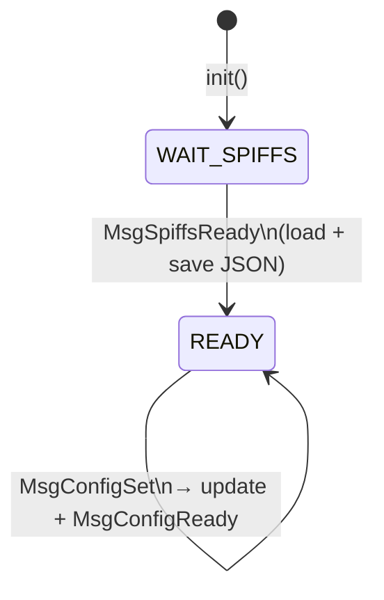
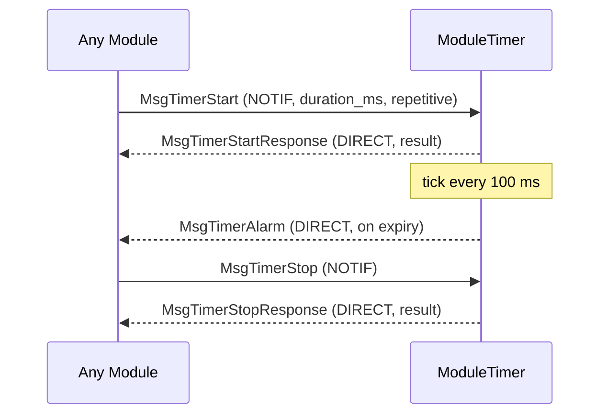
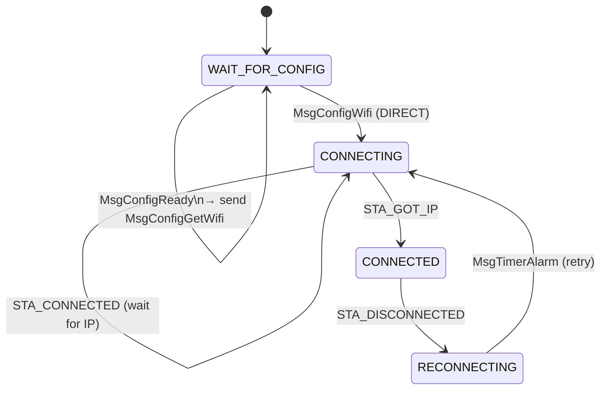
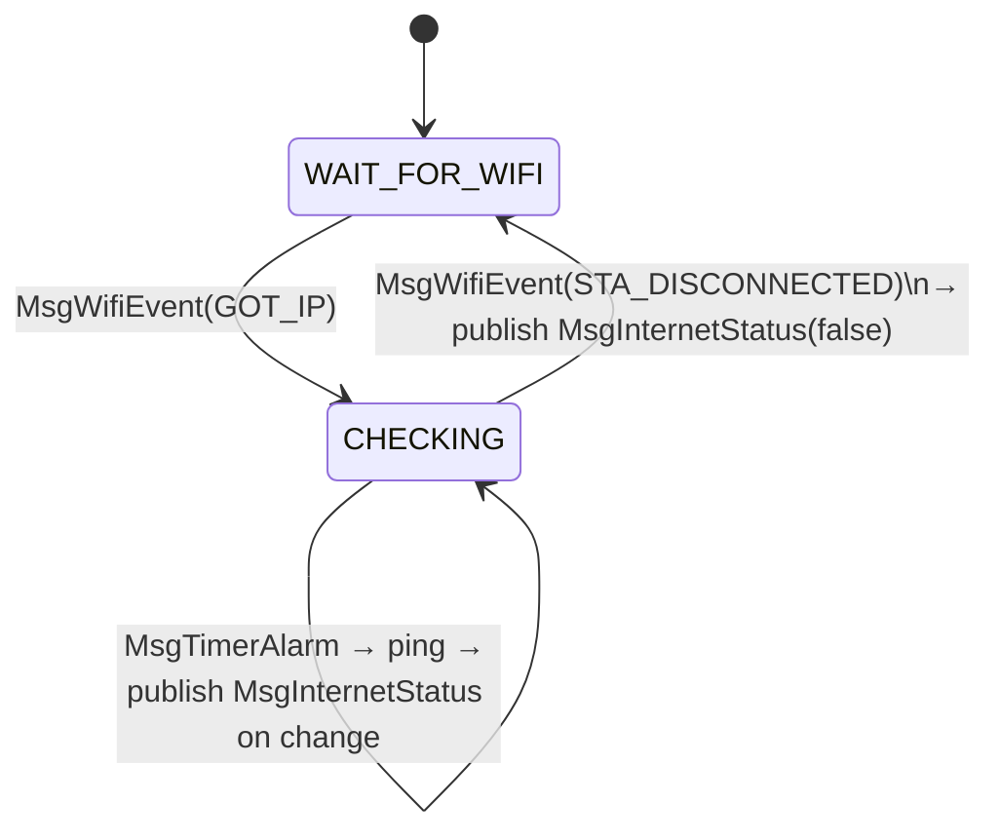
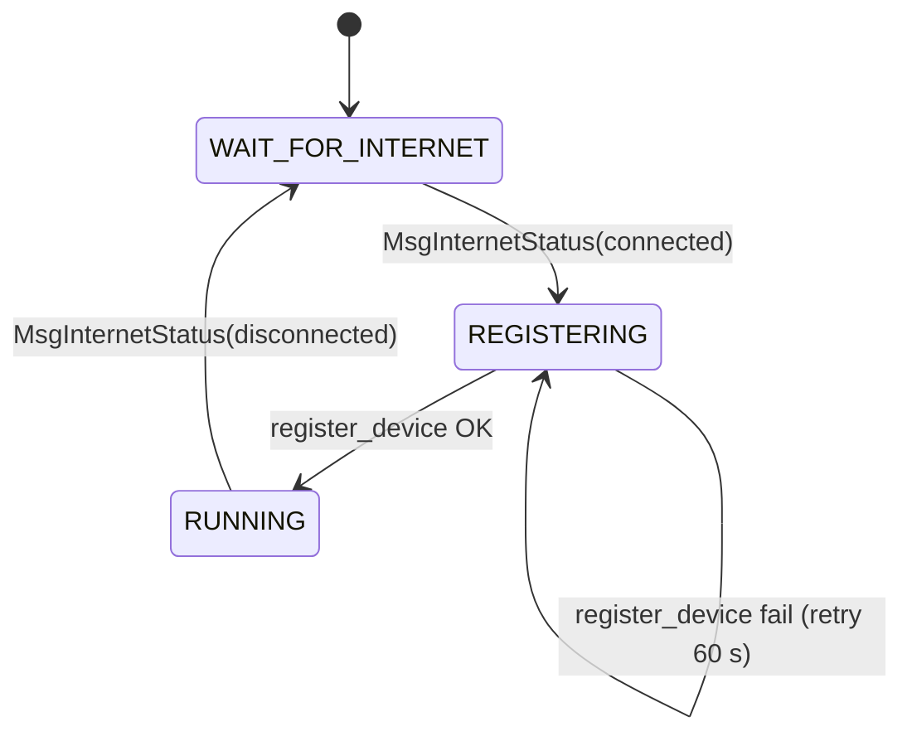
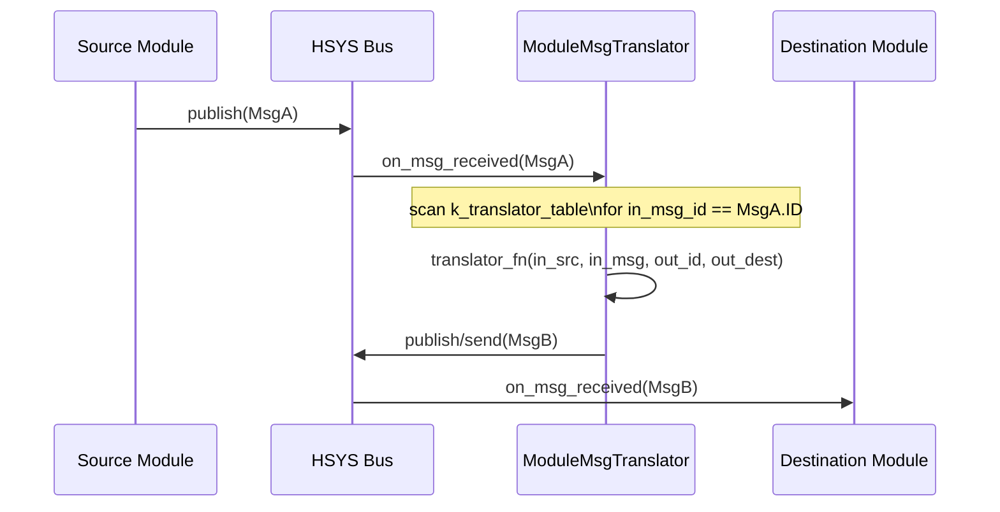
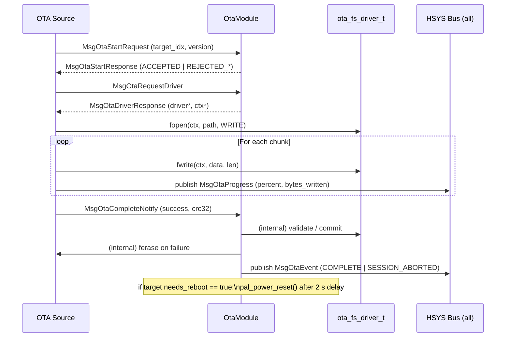
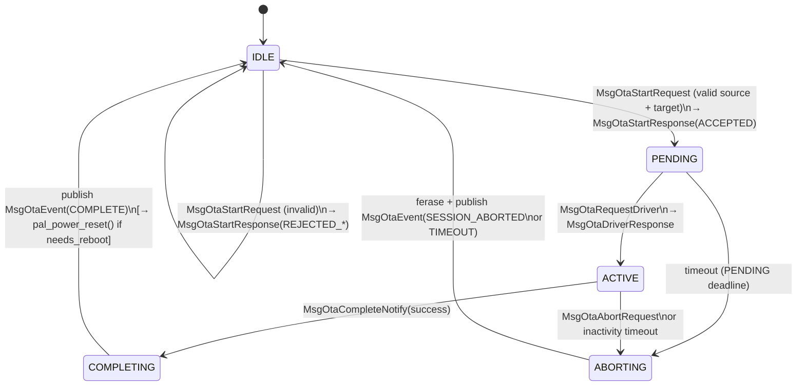
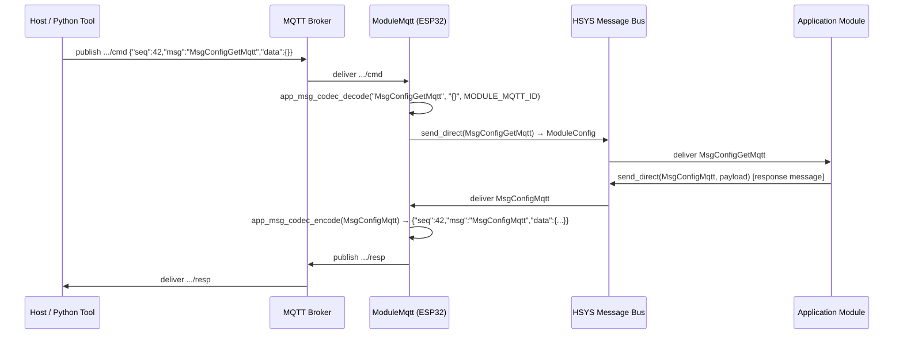
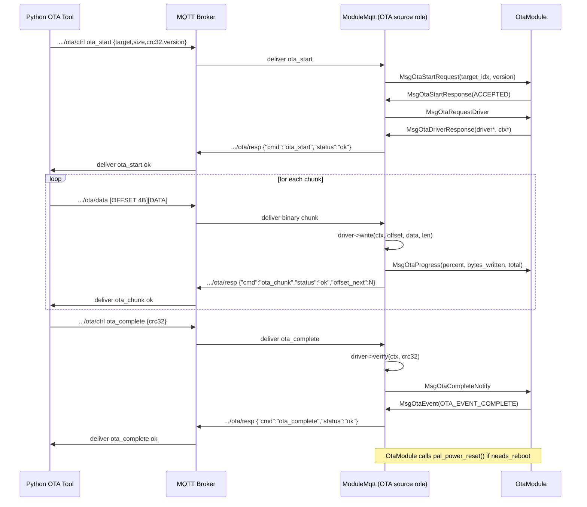

# HSYS Firmware User Manual

> **Scope:** Framework-level reference — covers the HSYS messaging architecture, module system, OTA protocol, and tooling.  
> Application-specific behaviour is documented separately in the product spec.

---

## Table of Contents

1. [Architecture](#1-architecture)
2. [Folder Structure](#2-folder-structure)
3. [Messages](#3-messages)
4. [Modules](#4-modules)
5. [OTA](#5-ota)
6. [MQTT](#6-mqtt)

---

## 1. Architecture

### 1.1 Layer Overview

```
┌──────────────────────────────────────────────────────────────────┐
│                        Application Layer                         │
│  (app.cpp · msg_translators · product-specific modules)          │
├───────────────────────┬──────────────────────────────────────────┤
│     App Modules       │          App Messages                    │
│  (module_wifi, etc.)  │  (MsgConfigWifi, MsgFuelPumped, etc.)    │
├───────────────────────┴──────────────────────────────────────────┤
│                     HSYS Framework                               │
│  hsys_module · hsys_msg · hsys_pool · hsys_task_mgr             │
├──────────────────────────────────────────────────────────────────┤
│                       HSYS OS                                    │
│  hsys_task · hsys_queue · hsys_mutex · hsys_semaphore           │
├──────────────────────────────────────────────────────────────────┤
│                  Platform Abstraction Layer (PAL)                │
│  pal_wifi · pal_mqtt · pal_gpio · pal_spiffs · pal_fw_update … │
├────────────────┬─────────────────────────────────────────────────┤
│   ESP-IDF      │   macOS (Simulator)   │   Arduino (future)      │
└────────────────┴───────────────────────┴─────────────────────────┘
```

---

### 1.2 Startup Sequence

```
main()
  │
  ├─ app_platform_pre_init()        (platform hook — sim socket, logger)
  │
  ├─ ModuleMsgTranslator::set_table()   (inject translator table before init)
  │
  ├─ app_config_init()              (load defaults, init config handle)
  │
  ├─ hsys_pool_init()               (allocate static buffer pool)
  │
  ├─ hsys_module_init()             (register all modules from k_module_table)
  │
  ├─ hsys_msg_init()                (init bus + register descriptor table)
  │
  └─ hsys_task_mgr_init()           (create RTOS tasks per k_task_table)
         │
         └─ per-task dispatch loop:
               ├─ phase 1: pre_init()   (all modules, all tasks)
               ├─ phase 2: init()       (all modules → subscribe())
               ├─ phase 3: post_init()  (publish first one-shot messages)
               └─ loop: dequeue → dispatch → release
```

---

### 1.3 Message Lifecycle

```
Publisher                 Bus                      Subscriber(s)
    │                      │                            │
    ├─ create_typed<T>()   │                            │
    │   pool_alloc()       │                            │
    │                      │                            │
    ├─ publish(msg) ───────►  stamp ref_count=N         │
    │                      │  enqueue to each           │
    │                      │  subscriber's queue ───────►
    │                      │                            │
    │                      │            on_msg_received()
    │                      │                            │
    │                      │◄─────────── hsys_msg_release()
    │                      │  ref_count-- (per delivery)│
    │                      │  pool_free() when == 0     │
```

**Key properties:** Zero-copy fan-out · Ref-counted release · Pool-backed (no heap at runtime) · Thread-safe

---

### 1.4 Message Types

| Type | Routing | `receiver_id` | Typical use |
|------|---------|--------------|-------------|
| `HSYS_MSG_NOTIFICATION` | All subscribers | 0 | Events, status changes |
| `HSYS_MSG_DIRECT` | One module | target ID | Request/response pairs |

---

### 1.5 Initialization Phase Barrier

```
Task A (storage_task)    Task B (network_task)    Task C (ota_task)
       │                         │                       │
  pre_init()                pre_init()              pre_init()
       │                         │                       │
       ├──────── barrier ────────┼───────────────────────┤
       │                         │                       │
     init()                    init()                  init()
       │                         │                       │
       ├──────── barrier ────────┼───────────────────────┤
       │                         │                       │
  post_init()              post_init()             post_init()
       │                         │                       │
       ├──────── barrier ────────┼───────────────────────┤
       │                         │                       │
     loop()                    loop()                  loop()
```

All three phases complete **globally** before any task enters its message loop.

---

## 2. Folder Structure

### 2.1 Tree

```
ferp-message-library/
├── documents/               # Architecture and design docs
├── src/
│   ├── app-messages/        # Typed message class definitions (IHsysMsg subclasses)
│   │   ├── buttons/         # Button press messages
│   │   ├── cloud/           # Cloud status messages
│   │   ├── configs/         # Config lifecycle messages
│   │   ├── fuel/            # Fuel dispenser messages
│   │   ├── mqtt/            # MQTT status messages
│   │   ├── ota/             # OTA session messages
│   │   ├── system/          # SPIFFS/SD/Time system messages
│   │   ├── timer/           # Timer request/response messages
│   │   ├── wifi/            # WiFi event messages
│   │   ├── messages/        # Shared JSON message definitions (for tools)
│   │   ├── app_msg_codec.h  # MQTT JSON encode/decode registry
│   │   └── IHsysMsg.h       # Abstract base for all typed messages
│   │
│   ├── app-modules/         # Reusable application modules (HsysModule subclasses)
│   │   ├── ticker/
│   │   ├── module_sysmon/
│   │   ├── module_spiffs/
│   │   ├── module_config/
│   │   ├── module_timer/
│   │   ├── module_leds/
│   │   ├── module_default_btn/
│   │   ├── module_print_btn/
│   │   ├── module_fuel/
│   │   ├── module_buzzer/
│   │   ├── module_cloud/
│   │   ├── module_internet/
│   │   ├── module_wifi/
│   │   ├── module_sd/
│   │   ├── module_timemgr/
│   │   ├── module_ota/      # OTA session manager (target-agnostic)
│   │   ├── module_web_client_ota/   # HTTP-polling OTA source
│   │   ├── module_mqtt/     # MQTT bridge + OTA source
│   │   └── module_msg_translator/  # Rule-table message translator
│   │
│   ├── sub-modules/
│   │   ├── hsys-framework/  # Core: pool, module, msg, task_mgr
│   │   ├── hsys-os/         # RTOS abstraction (queue, mutex, task…)
│   │   ├── pal/             # Platform abstraction (wifi, mqtt, gpio…)
│   │   ├── middleware/       # FileSystemDriver, hsys_config, list-manager
│   │   ├── bsp/             # Board support (GPIO pins, I2C addresses)
│   │   ├── drivers/         # Peripheral drivers (DS1307, sensors…)
│   │   ├── utils/           # crc32, string helpers
│   │   └── ferp-device-firmware/
│   │
│   └── product/
│       ├── app/             # Shared app.cpp, app_module_ids.h, msg_translators
│       └── ferp-com-main/
│           ├── app/         # Product-specific app_module_ids.h, app_msg_ids.h
│           ├── ferp-com-esp32-idf/  # ESP32 build target
│           └── ferp-com-simulator/  # macOS simulator build target
│
├── tools/
│   └── ferp-mqtt-tool/      # Python GUI + CLI MQTT tool
│       ├── ferp_mqtt_gui.py
│       ├── ferp_mqtt_ota.py
│       ├── ferp_mqtt_listen.py
│       └── messages/        # msg_loader.py, ota_session.py, msg_defs.py
│
└── test-bins/               # Test firmware binaries for OTA testing
```

---

### 2.2 Key Files Reference

| File | Purpose |
|------|---------|
| `src/product/app/app.cpp` | Shared init: pool, module, task, codec tables |
| `src/product/app/app_module_ids.h` | All module ID constants |
| `src/product/ferp-com-main/app/app_msg_ids.h` | All message ID constants |
| `src/app-modules/app_msg_table.h` | Descriptor table (`HSYS_MSG_DESC` entries) |
| `src/sub-modules/hsys-framework/hsys_config.h` | Framework compile-time limits |
| `src/product/app/msg_translators.cpp` | Translation function implementations |

---

## 3. Messages

### 3.1 Class Contract

Every message class must:

| Requirement | Detail |
|-------------|--------|
| Inherit `IHsysMsg` | Base from `IHsysMsg.h` |
| `static constexpr ID` | References `app_msg_ids.h` constant |
| `static constexpr DESCRIPTOR` | `HSYS_MSG_DESC(id, type, payload_size, pub_perm, sub_perm)` |
| Inner `Payload` struct | Plain data, no pointers (serialised into pool buffer) |
| `create(sender_id, payload)` | Static factory — allocates from pool |
| `deserialize(msg)` | Static — copies payload out of pool buffer |

---

### 3.2 Message ID Space

| Range | Domain |
|-------|--------|
| `0x0000` | Reserved (invalid) |
| `0x0100 – 0x010F` | Timer control |
| `0x0200 – 0x02FF` | System / timing |
| `0x0300 – 0x03FF` | Configuration |
| `0x0800 – 0x08FF` | Fuel / dispenser |
| `0x0900 – 0x09FF` | Buttons |
| `0x0A00 – 0x0AFF` | Connectivity, OTA, MQTT |
| `0xFFFF` | Reserved (invalid) |

---

### 3.3 Complete Message Table

| Message Class | ID | Type | Payload fields | Publisher → Subscriber |
|---|---|---|---|---|
| `MsgTick1000ms` | `0x0200` | NOTIF | — | Ticker → all |
| `MsgSpiffsReady` | `0x0201` | NOTIF | — | ModuleSpiffs → all |
| `MsgSdReady` | `0x0202` | NOTIF | — | ModuleSD → all |
| `MsgSdStatus` | `0x0203` | NOTIF | `type`, `size_mb`, `free_mb` | ModuleSD → all |
| `MsgTimeStatus` | `0x0204` | NOTIF | `source`, `valid`, `epoch` | ModuleTimeMgr → all |
| `MsgTimerStart` | `0x0100` | NOTIF | `duration_ms`, `repetitive` | Any → ModuleTimer |
| `MsgTimerStop` | `0x0101` | NOTIF | — | Any → ModuleTimer |
| `MsgTimerStartResponse` | `0x0102` | DIRECT | `result` | ModuleTimer → requester |
| `MsgTimerStopResponse` | `0x0103` | DIRECT | `result` | ModuleTimer → requester |
| `MsgTimerAlarm` | `0x0104` | DIRECT | — | ModuleTimer → registered |
| `MsgConfigReady` | `0x0300` | NOTIF | — | ModuleConfig → all |
| `MsgConfigSet` | `0x0301` | NOTIF | `key[32]`, `value[64]` | Any → ModuleConfig |
| `MsgConfigGet` | `0x0302` | NOTIF | — | Any → ModuleConfig |
| `MsgConfigGetWifi` | `0x0303` | NOTIF | — | Any → ModuleConfig |
| `MsgConfigGetCloud` | `0x0304` | NOTIF | — | Any → ModuleConfig |
| `MsgConfigGetMqtt` | `0x0305` | NOTIF | — | Any → ModuleConfig |
| `MsgConfigGetDt` | `0x0306` | NOTIF | — | Any → ModuleConfig |
| `MsgConfigGetOta` | `0x030B` | NOTIF | — | Any → ModuleConfig |
| `MsgConfigWifi` | `0x0307` | DIRECT | `ssid[64]`, `password[64]` | ModuleConfig → requester |
| `MsgConfigCloud` | `0x0308` | DIRECT | `url[128]`, `secret[64]`, `hb_interval_s`, `hb_enabled` | ModuleConfig → requester |
| `MsgConfigMqtt` | `0x0309` | DIRECT | `host[64]`, `port`, `user[32]`, `password[32]` | ModuleConfig → requester |
| `MsgConfigDt` | `0x030A` | DIRECT | `display_type`, `stabilize_delay_ms` | ModuleConfig → requester |
| `MsgConfigOta` | `0x030C` | DIRECT | `server_url[128]`, `check_interval_s` | ModuleConfig → requester |
| `MsgFuelPumped` | `0x0800` | NOTIF | `volume_ml`, `transaction_id` | ModuleFuel → all |
| `MsgNozzleState` | `0x0801` | NOTIF | `state`, `nozzle_id` | ModuleFuel → all |
| `MsgDefaultBtn` | `0x0900` | NOTIF | `button_id`, `press_type` | ModuleDefaultBtn → all |
| `MsgPrinterBtn` | `0x0901` | NOTIF | `button_id`, `status` | ModulePrintBtn → all |
| `MsgWifiEvent` | `0x0A00` | NOTIF | `event`, `rssi` | ModuleWifi → all |
| `MsgInternetStatus` | `0x0A01` | NOTIF | `connected` | ModuleInternet → all |
| `MsgCloudStatus` | `0x0A02` | NOTIF | `event`, `success` | ModuleCloud → all |
| `MsgOtaStartRequest` | `0x0A03` | DIRECT | `target_idx`, `incoming_version[32]` | Source → OtaModule |
| `MsgOtaStartResponse` | `0x0A04` | DIRECT | `result` | OtaModule → Source |
| `MsgOtaRequestDriver` | `0x0A05` | DIRECT | — | Source → OtaModule |
| `MsgOtaDriverResponse` | `0x0A06` | DIRECT | `driver*`, `ctx*` | OtaModule → Source |
| `MsgOtaAbortRequest` | `0x0A07` | DIRECT | — | Source → OtaModule |
| `MsgOtaCompleteNotify` | `0x0A08` | DIRECT | `success`, `crc32` | Source → OtaModule |
| `MsgOtaEvent` | `0x0A09` | NOTIF | `event`, `target_idx`, `version[32]` | OtaModule → all |
| `MsgOtaProgress` | `0x0A0A` | NOTIF | `target_idx`, `percent`, `bytes_written`, `total_bytes` | Source → all |
| `MsgMqttStatus` | `0x0A0B` | NOTIF | `connected` | ModuleMqtt → all |

---

### 3.4 Permissions

`pub_perm` and `sub_perm` are bitmasks of allowed module IDs.

| Constant | Value | Meaning |
|----------|-------|---------|
| `HSYS_PERM_ANY` | `0xFFFFFFFF` | Any module |
| `HSYS_PERM_NONE` | `0x00000000` | Nobody (disabled) |

---

### 3.5 Buffer Pool

Pool classes are defined per-product in `app.cpp`. Example configuration:

| Block size | Count | Usage |
|-----------|-------|-------|
| 4 B | 8 | Tiny control messages |
| 32 B | 32 | Timer, button messages |
| 64 B | 32 | Config get/status messages |
| 256 B | 24 | Config payload messages |
| 512 B | 8 | Large payloads (config JSON) |

> **Framework limits** (override via compiler flags or `hsys_config.h`):

| Constant | Default | Purpose |
|----------|---------|---------|
| `HSYS_MAX_MODULES` | 16 | Registered module slots |
| `HSYS_MAX_TASKS` | 8 | RTOS tasks |
| `HSYS_DEFAULT_QUEUE_DEPTH` | 16 | Per-task inbox depth |
| `HSYS_MAX_MSG_IDS` | 1024 | Subscription table width |
| `HSYS_MAX_SUBSCRIBERS_PER_MSG` | 8 | Fanout per message ID |
| `HSYS_POOL_CLASS_COUNT` | 8 | Pool size classes |

---

## 4. Modules

### 4.1 Module Registry

| ID | Class | Task | Description |
|----|-------|------|-------------|
| 3 | `Ticker` | `timing_task` | 1 s heartbeat publisher |
| 4 | `ModuleSysmon` | `indicator_task` | Pool & stats reporter |
| 5 | `ModuleSpiffs` | `storage_task` | SPIFFS mount |
| 6 | `ModuleConfig` | `storage_task` | Persistent JSON config |
| 7 | `ModuleTimer` | `timing_task` | Software timer slots |
| 8 | `ModuleLeds` | `indicator_task` | Status LED driver |
| 9 | `ModuleDefaultBtn` | `btn_task` | Default button debounce |
| 10 | `ModulePrintBtn` | `btn_task` | Print button debounce |
| 11 | `ModuleFuel` | `fuel_task` | Fuel dispenser state machine |
| 12 | `ModuleBuzzer` | `indicator_task` | Piezo buzzer patterns |
| 13 | `ModuleCloud` | `network_task` | HTTPS cloud backend |
| 14 | `ModuleInternet` | `network_task` | Internet ping monitor |
| 15 | `ModuleWifi` | `network_task` | WiFi connection manager |
| 16 | `ModuleSD` | `storage_task` | SD card mount |
| 17 | `ModuleTimeMgr` | `timemgr_task` | RTC / NTP / SPIFFS backup |
| 18 | `OtaModule` | `ota_task` | OTA session manager |
| 19 | `ModuleWebClientOta` | `web_ota_task` | HTTP-polling OTA source |
| 22 | `ModuleMqtt` | platform task | MQTT bridge + OTA source |
| 23 | `ModuleMsgTranslator` | `xlat_task` | Rule-table message translator |

---

### 4.2 Module Dependency Map

```
MsgSpiffsReady
  ModuleSpiffs ──────────────────────────────────► ModuleConfig
                                                        │
                                          MsgConfigReady (broadcast)
                                                        │
                              ┌─────────────────────────┼──────────────────┐
                              ▼                         ▼                  ▼
                          ModuleWifi               ModuleMqtt          ModuleFuel
                              │                         │
                        MsgWifiEvent(GOT_IP)     MsgConfigGetMqtt
                              │
                     ┌────────┴────────┐
                     ▼                 ▼
               ModuleInternet     ModuleCloud
                     │
              MsgInternetStatus(connected)
                     │
              ┌──────┴──────┐
              ▼             ▼
          ModuleMqtt    ModuleCloud
```

---

### 4.3 Ticker

**Purpose:** Generates a 1 s system heartbeat via a soft-timer.

```
init()
  └─ hsys_soft_timer_start(1000ms, auto-reload)
         │
         └─ callback: publish MsgTick1000ms
```

| | |
|--|--|
| Subscribes | — |
| Publishes | `MsgTick1000ms` |
| Task | `timing_task` |

---

### 4.4 ModuleSysmon

**Purpose:** Periodic pool and message-header diagnostics report to stdout.

| | |
|--|--|
| Subscribes | `MsgTick1000ms` |
| Publishes | — |
| Task | `indicator_task` |
| Config | `SYSMON_REPORT_INTERVAL_TICKS` (default 5) |

---

### 4.5 ModuleSpiffs

**Purpose:** Mounts SPIFFS in `pre_init()`, announces readiness in `post_init()`.

```
pre_init()  → pal_spiffs_mount()
post_init() → publish MsgSpiffsReady
```

| | |
|--|--|
| Subscribes | — |
| Publishes | `MsgSpiffsReady` |
| Task | `storage_task` |

---

### 4.6 ModuleConfig

**Purpose:** Reads `Configs/DeviceConfigs.json` from SPIFFS, merges defaults, responds to typed config requests.



| Subscribes | Publishes |
|-----------|-----------|
| `MsgSpiffsReady` | `MsgConfigReady` |
| `MsgConfigGet*` (all variants) | `MsgConfigWifi / Cloud / Mqtt / Ota` (DIRECT) |
| `MsgConfigSet` | |

| Config param | Source | Notes |
|---|---|---|
| `Configs/DeviceConfigs.json` | SPIFFS | Key-value JSON file |
| Config table | `app.cpp` | `config_t[]` array |

---

### 4.7 ModuleTimer

**Purpose:** Software timer service — any module can request a one-shot or repeating alarm.



| | |
|--|--|
| Max slots | `MODULE_TIMER_MAX_SLOTS` (default 20) |
| Resolution | ±100 ms |
| Task | `timing_task` |

---

### 4.8 ModuleWifi

**Purpose:** WiFi connection manager with auto-reconnect.



| Subscribes | Publishes |
|-----------|-----------|
| `MsgConfigReady` | `MsgConfigGetWifi` |
| `MsgConfigWifi` | `MsgWifiEvent` |
| `MsgTimerAlarm` | |

| Param | Default |
|-------|---------|
| Retry interval | 10 000 ms |

---

### 4.9 ModuleInternet

**Purpose:** Periodically pings `8.8.8.8` and publishes connectivity change.



| Subscribes | Publishes |
|-----------|-----------|
| `MsgWifiEvent` | `MsgInternetStatus` |
| `MsgTimerAlarm` | |

| Param | Default |
|-------|---------|
| Check interval | 60 000 ms |
| Ping host | `8.8.8.8` |
| Ping timeout | 2 000 ms |

---

### 4.10 ModuleCloud

**Purpose:** HTTPS cloud backend, device registration, heartbeat, and data upload.



| | |
|--|--|
| Backend | `cloud_driver_t` — set via `set_driver()` before `app_init()` |
| HB interval | `MODULE_CLOUD_DEFAULT_HB_INTERVAL_MS` (60 000 ms) |
| Retry | 60 000 ms |

---

### 4.11 ModuleSD

**Purpose:** SD card mount. Publishes `MsgSdReady` and `MsgSdStatus` after mount.

| Subscribes | Publishes |
|-----------|-----------|
| — | `MsgSdReady`, `MsgSdStatus` |
| | Task: `storage_task` |

---

### 4.12 ModuleTimeMgr

**Purpose:** Maintains accurate system time from three cascaded sources — SPIFFS backup, DS1307 hardware RTC, and NTP — with automatic fallback and progressive upgrade as sources become available.

**Hardware note:** The DS1307 chip contains 56 bytes of NVRAM (registers 0x08–0x3F) backed by the same coin cell as the RTC oscillator. This NVRAM is too small to store auxiliary data reliably, so SPIFFS is used for the backup file instead.

#### Source Priority

```
NONE → SPIFFS backup → DS1307 RTC → NTP (most reliable)
```

Each successful source sets the OS system time (`settimeofday`) and the module continues trying better sources in the background.

#### State Machine

```
Boot
 │
 ├─[MsgSpiffsReady]────────────────────────────────────────► LOAD_BACKUP
 │                                                               │
 │              fail (absent / corrupt / time < 2020)            │ ok
 │           ◄──────────────────────────────────────────────────  │
 │                                                               ▼
 │                                               set sys_time = backup_time
 │                                               publish MsgTimeStatus(BACKUP)
 │                                                               │
 └──────────────────────────────────────────────────────── LOAD_RTC
                                                                │
                   fail (I2C error / CH bit / time < 2020)      │ ok
                ◄──────────────────────────────────────────────  │
                                                                ▼
                                                set sys_time = rtc_time
                                                update SPIFFS backup
                                                publish MsgTimeStatus(RTC)
                                                                │
                                                                ▼
                                                       WAIT_FOR_INTERNET
                                                                │
                                         [MsgInternetStatus connected=true]
                                                                │
                                                                ▼
                                                          NTP_SYNC
                                              ok           │      fail → retry 60 s
                                         ┌────────────────  │  ──────────────────────►
                                         ▼
                               set sys_time = ntp_time
                               ds1307_set_time(ntp_time)   ← write back to RTC
                               update SPIFFS backup
                               publish MsgTimeStatus(NTP)
                                         │
                                         ▼
                                       READY
                               periodic backup timer (5 min)
                               re-sync NTP on next MsgInternetStatus(connected)
```

**Critical failure fallback** (no SPIFFS, no RTC, no internet after 20 s): publish `MsgTimeStatus(source=NONE, valid=false)`. Subscribers must treat all timestamps as unreliable.

#### MsgTimeStatus Payload

```cpp
struct Payload {
    time_t   epoch;     // Unix timestamp (0 = unknown)
    uint8_t  source;    // time_source_t enum
    bool     valid;     // false = no reliable source yet
};

enum time_source_t : uint8_t {
    TIME_SOURCE_NONE   = 0,
    TIME_SOURCE_BACKUP = 1,   // SPIFFS file — least reliable
    TIME_SOURCE_RTC    = 2,   // DS1307 hardware clock
    TIME_SOURCE_NTP    = 3,   // NTP — most reliable
};
```

Published on every source transition, on critical failure, and at each periodic backup write.

#### Subscribed Messages

| Message | Purpose |
|---------|---------|
| `MsgSpiffsReady` | Gate: start source chain when filesystem is available |
| `MsgInternetStatus` | Trigger NTP sync on connect; stop on disconnect |
| `MsgTimerAlarm` | Periodic 5-minute SPIFFS backup write |
| `MsgTimerStartResponse` | Confirm timer slot was allocated |

#### SPIFFS Backup Design

| Property | Detail |
|----------|--------|
| File path | `/timemgr.bin` |
| Format | Raw `time_t` value — 8 bytes, little-endian |
| Write guard | Write only when `|current_time − last_written| >= 300 s` |
| Writes/day | `86400 / 300 = 288` |
| Wear estimate | Several years even on shared SPIFFS partition (SPIFFS wear-levelling) |

`timemgr.bin` and `DeviceConfigs.json` are separate SPIFFS files allocated in different logical pages — writes to one do not affect the other.

#### Simulator I2C Architecture

The DS1307 driver (`ds1307.hpp`/`ds1307.cpp`) runs **unmodified** on both ESP32 and the macOS simulator. The difference is only the PAL layer beneath it.

```
ds1307.cpp
    │  calls pal_i2c_write_read(PORT_0, 0x68, ...)
    ▼
pal_mac_i2c.cpp                ← macOS PAL — implements pal_i2c.h
    │  look up addr 0x68 in emulator table
    ▼
ds1307_i2c_emulator.cpp        ← in-memory DS1307 register bank
    │  on read:  gettimeofday() → BCD-encode → return bytes
    │  on write: decode BCD → store as time-offset delta
    ▼
(no real I2C bus — pure in-process function calls)
```

**Emulator interface:**

```c
typedef struct {
    int32_t (*on_write)     (const uint8_t *data, size_t len, void *ctx);
    int32_t (*on_write_read)(const uint8_t *wr, size_t wr_len,
                              uint8_t *rd,       size_t rd_len, void *ctx);
    void *ctx;
} pal_i2c_emulator_t;
```

Register the emulator in `app_platform_pre_init()` (simulator's `sim_init.cpp`) before `app_init()`:

```cpp
pal_mac_i2c_register_device(PAL_I2C_PORT_0, APP_HW_I2C_ADDR_DS1307, &s_ds1307_emulator);
```

**NTP on simulator:** `pal_mac_ntp.cpp` is a no-op stub — host macOS is already NTP-synchronised. `pal_ntp_sync_start()` immediately sets status to `COMPLETED` and `pal_ntp_get_epoch_time()` calls `gettimeofday()`. This causes ModuleTimeMgr to immediately publish `MsgTimeStatus(NTP)` on the simulator.

| Subscribes | Publishes |
|-----------|-----------|
| `MsgSpiffsReady` | `MsgTimeStatus` |
| `MsgInternetStatus` | |
| `MsgTimerAlarm` | |

---

### 4.13 ModuleLeds

**Purpose:** Maps HSYS events to LED GPIO patterns.

| Subscribes | LED reaction |
|-----------|-------------|
| `MsgConfigReady` | Boot indication |
| `MsgWifiEvent` | WiFi status pattern |
| `MsgInternetStatus` | Internet status pattern |
| `MsgOtaEvent` | OTA progress / complete pattern |

---

### 4.14 ModuleBuzzer

**Purpose:** Maps HSYS events to piezo buzzer patterns via `hsys_buz` soft-timer.

| Event | Pattern |
|-------|---------|
| `MsgPrinterBtn` (print-1 short) | Solid 2 s tone |
| `MsgFuelPumped` | Double blip |
| `MsgConfigReady` | Boot chime |

---

### 4.15 ModuleDefaultBtn / ModulePrintBtn

**Purpose:** Hardware button debounce and press-type classification.

| Publishes | Payload |
|-----------|---------|
| `MsgDefaultBtn` | `button_id`, `press_type` |
| `MsgPrinterBtn` | `button_id`, `status` |

---

### 4.16 ModuleFuel

**Purpose:** Fuel dispenser control state machine — receives binary frames from the DispTap co-processor, runs the Sanki/Censtar/Wayne state machine per nozzle, and publishes transaction events.

#### Design Rationale

The DispTap data stream is high-frequency (10–30 frames/second/nozzle while pumping). Routing every frame through the HSYS message bus would be wasteful. Instead, the DT serial driver calls a **direct C function** inside `ModuleFuel` from its own task. Only low-frequency events cross the bus: lifecycle signals and the final `MsgFuelPumped` (one per transaction).

Nozzle GPIO inputs are time-critical — any bus latency would cause missed transitions. Each nozzle GPIO is debounced with a `hsys_tog_button_t` registered directly inside `ModuleFuel`. Callbacks set **event-group bits** consumed in `ModuleFuel`'s own task loop.

#### Internal Structure

```
ModuleFuel
├── init()               subscribe MsgConfigReady; register GPIO callbacks → hsys_tog_button_t nozzle[2]
├── on_msg_received()    dispatch MsgConfigReady → _driver.on_config_ready()
├── run()                check _fuel_event event-group bits each iteration:
│                          NOZZLE1_START/STOP → _processors[0].set_nozzle_state()
│                          NOZZLE2_START/STOP → _processors[1].set_nozzle_state()
├── on_pumped(n_idx)     fill + publish MsgFuelPumped, MsgNozzleState(PUMPED)
│
├── hsys_tog_button_t     _nozzle[2]        debounced GPIO (internal — not on bus)
│     debounce: 500 ms press / 500 ms release
│
├── hsys_eventgroup_t     _fuel_event
│     bits: NOZZLE1_START | NOZZLE1_STOP | NOZZLE2_START | NOZZLE2_STOP
│
├── FuelDispTapDriver     _driver
│   ├── on_config_ready()   read display_type from config, select DT board type
│   ├── _run_lifecycle()    WAIT_CONFIG → RESETTING → FW_UPDATE → RUNNING
│   ├── _on_frame_display1() decode frame → _processors[0].push_frame()
│   └── _on_frame_display2() decode frame → _processors[1].push_frame()
│
└── FuelSankiProcessor    _processors[FUEL_MAX_NOZZLES]
    └── push_frame()      direct call from driver (not via bus)
```

#### FuelDispTapDriver Lifecycle State Machine

```
WAIT_CONFIG
    │ MsgConfigReady
    ▼
RESETTING         GPIO reset pulse to DT board (500 ms)
    │ timeout
    ▼
FW_UPDATE         distap_get_fw_version() → compare vs expected version
    │             version match                      version mismatch
    │──────────────────────────────────┐  ┌─────────────────────────────────┐
    │                                  ▼  ▼                                 │
    │                              RUNNING              start_serial_flash() │
    │                                              ──────────────────────────┘
    ▼
RUNNING           init_comms_distap(_on_frame_display1, _on_frame_display2)
                  serial frames flowing → _processors[n].push_frame()
```

#### Messages

| Message | ID | Type | Payload |
|---------|-----|------|---------|
| `MsgFuelPumped` | `0x0800` | NOTIFICATION | `n_idx`, `unit_pricex100`, `total_pricex100`, `volume_lx1000`, `time_stamp` |
| `MsgNozzleState` | `0x0801` | NOTIFICATION | `n_idx`, `state` (IDLE/PUMPING/PUMPED) |
| `MsgDTFwVersion` | `0x0802` | NOTIFICATION | `version[32]`, `board_type` |

> `MsgDispTapData` (raw frame) is **intentionally absent from the bus** — it is a direct call within `ModuleFuel`. Nozzle start/stop GPIO events are also **not on the bus** — handled internally via `hsys_tog_button_t` + event-group bits.

#### Key Data Types

```cpp
// Raw frame from DT board (filled by FuelDispTapDriver, consumed by FuelSankiProcessor)
// display_data_t (packed, 13 bytes):
//   flags:       { start_stop:1, select_p:1, select_l:1, select_ll:1 }
//   error:       { index:1, unitprice:1, totprice:1, volume:1, price_gap:1 }
//   total_price: uint32_t ×0.01  (e.g. 1500 = $15.00)
//   volume_l:    uint32_t ×0.001 (e.g. 5000 = 5.000 L)
//   unit_price:  uint32_t ×0.01  (e.g. 300  = $3.00)

// Final pumped event
struct nozzle_event_t {
    uint8_t  n_idx;
    uint32_t unit_pricex100;
    uint32_t total_pricex100;
    uint32_t volume_lx1000;
};
```

#### DT Board Submodule Interfaces

These C APIs are consumed from the `ferp-device-firmware` submodule. They are **ESP-IDF only** — the simulator provides Mac replacements behind `FERP_SIMULATOR` guards.

| Header | Purpose |
|--------|---------|
| `display_types.h` | `display_type_t` enum, `display_data_t` packed struct, `data_flags_t`, `data_error_t`, `input_pin_t` |
| `com_distap.h` | UART framing: `init_comms_distap(dis1_cb, dis2_cb)`, `distap_send_cmd()` |
| `cmd_distap.h` | Commands: `distap_get_fw_version()`, `distap_set_display_type()`, `distap_set_err_mask()` |
| `serial_flasher.h` | `start_serial_flash(skip_version_check)` — streams binary to DT board over UART |

#### Simulator Replacements

| Header | Simulator strategy |
|--------|-------------------|
| `com_distap.h` | `mac_com_distap.cpp` — stores callbacks; `mac_distap_inject_frame()` calls them directly |
| `cmd_distap.h` | `mac_cmd_distap.cpp` — returns `"SIM_1.0.0"` and `ESP_OK` immediately (no DT board) |
| `serial_flasher.h` | Not compiled — FW_UPDATE state skips to RUNNING via simulated version match |

The Python UI sends pump frames over the TCP JSON channel:
```json
{ "cmd": "SIM_DISTAP_FRAME", "nozzle": 0, "display_type": 0, "unit_price": 300, "volume_l": 500 }
{ "cmd": "SIM_NOZZLE_INPUT", "nozzle": 0, "active": true }
```

| Publishes |
|-----------|
| `MsgFuelPumped` |
| `MsgNozzleState` |
| `MsgDTFwVersion` |

---

### 4.17 ModuleMsgTranslator

**Purpose:** Route-and-transform messages via a compile-time table. Decouples modules from each other.



**Table row structure:**

| Field | Type | Purpose |
|-------|------|---------|
| `in_msg_id` | `hsys_msg_id_t` | Message to watch |
| `in_src` | `hsys_module_id_t` | Required sender (0 = any) |
| `out_msg_id` | `hsys_msg_id_t` | Output message to produce |
| `out_dest` | `hsys_module_id_t` | Target (0 = broadcast) |
| `translator` | `msg_translator_fn_t` | Transform function |
| `delayed` | `bool` | Reserved for delayed publish |
| `delay_ms` | `uint32_t` | Delay when `delayed == true` |

**Translator prototype:**
```c
hsys_msg_t *fn(hsys_module_id_t in_src,
               const hsys_msg_t *in_msg,
               hsys_msg_id_t     out_msg_id,
               hsys_module_id_t  out_dest);
```

To add a translation rule:
1. Declare function in `src/product/app/msg_translators.h`
2. Implement in `src/product/app/msg_translators.cpp`
3. Add row to `k_translator_table[]` in `src/product/app/app.cpp`

---

## 5. OTA

### 5.1 Design Principles

- **OtaModule is a session manager only** — it never touches the binary data.
- **Sources** are application modules that know where firmware comes from (HTTP, MQTT, USB, etc.).
- **Targets** are platform-specific write backends (OTA partition, staging file, external flash…).
- **Binary data** flows directly from Source → Target driver — it never enters the HSYS message pool.

---

### 5.2 Actors

| Actor | Role |
|-------|------|
| **OtaModule** | Session gatekeeper: validates source & target, manages state, enforces timeout, publishes lifecycle events |
| **OTA Source** | Any registered module that initiates firmware delivery |
| **OTA Target** | `ota_target_desc_t` + `ota_fs_driver_t` — abstract write backend |

---

### 5.3 Session Protocol



---

### 5.4 OtaModule State Machine



---

### 5.5 Rejection Reasons

| Code | Meaning |
|------|---------|
| `OTA_START_ACCEPTED` | Session granted |
| `OTA_START_REJECTED_BUSY` | Another session is active |
| `OTA_START_REJECTED_UNKNOWN_SOURCE` | `sender_id` not in `ota_source_desc_t[]` |
| `OTA_START_REJECTED_UNKNOWN_TARGET` | `target_idx` not in `ota_target_desc_t[]` |

---

### 5.6 ota_fs_driver_t Interface

| Function | Signature | Purpose |
|----------|-----------|---------|
| `fopen` | `(ctx, path, mode) → err` | Prepare write target |
| `fwrite` | `(ctx, data, len) → err` | Write one sequential chunk |
| `fappend` | `(ctx, data, len) → err` | Append variant |
| `fclose` | `(ctx) → err` | Finalise and commit |
| `ferase` | `(ctx) → err` | Abort and clean up |
| `fread` | `(ctx, buf, len, out_len) → err` | Optional read-back |

---

### 5.7 Platform Wiring

Implement the weak function to supply source and target tables:

```c
void ota_platform_get_config(
    const ota_source_desc_t **sources, uint8_t *source_count,
    const ota_target_desc_t **targets, uint8_t *target_count);
```

**`ota_source_desc_t`:**

| Field | Type | Purpose |
|-------|------|---------|
| `source_module_id` | `uint16_t` | HSYS ID of the source module |
| `priority` | `uint8_t` | Reserved |
| `timeout_ms` | `uint32_t` | Inactivity timeout (0 = none) |

**`ota_target_desc_t`:**

| Field | Type | Purpose |
|-------|------|---------|
| `target_idx` | `uint8_t` | Index used in `MsgOtaStartRequest` |
| `needs_reboot` | `bool` | Call `pal_power_reset()` after COMPLETE |
| `label` | `const char *` | Human-readable name |
| `driver` | `const ota_fs_driver_t *` | Driver function table |
| `ctx` | `void *` | Opaque driver context |

---

### 5.8 Lifecycle Events (MsgOtaEvent)

| `event` | When |
|---------|------|
| `OTA_EVENT_SESSION_STARTED` | Driver handed to source, active write begins |
| `OTA_EVENT_SESSION_ABORTED` | Source aborted or OtaModule forced abort |
| `OTA_EVENT_COMPLETE` | Binary written and committed; reboot pending |
| `OTA_EVENT_TIMEOUT` | Inactivity or PENDING deadline expired |

---

### 5.9 Constraints

| # | Constraint |
|---|---|
| C1 | Only one OTA session may be active at a time. |
| C2 | Source and target descriptor tables are `const`, allocated at build time, passed to `OtaModule::set_tables()`. |
| C3 | Binary data does not enter the HSYS message pool. Only small control messages cross the bus. |
| C4 | Priority preemption is **not implemented** — ongoing OTA continues regardless of a new request's priority. The `priority` field is reserved as a placeholder. |
| C5 | `timeout_ms` is an **inactivity timeout**: it resets every time `ModuleOta` receives a `MsgOtaProgress` from the active source. If no progress is received within `timeout_ms`, the session is aborted. `0` = no timeout. Sources MUST publish `MsgOtaProgress` regularly to keep the session alive. |
| C6 | `ModuleOta` calls `pal_power_reset()` after publishing `MsgOtaEvent(COMPLETE)` with a short configurable delay. |
| C7 | On timeout or abort, `ModuleOta` calls `driver->ferase(ctx)` to clean up the partial write before returning to IDLE. |

---

### 5.10 Source and Target Descriptor Structs

```c
typedef struct {
    uint16_t source_module_id;  // HSYS module ID of the OTA source
    uint8_t  priority;          // reserved — not enforced
    uint32_t timeout_ms;        // inactivity timeout; resets on each MsgOtaProgress; 0 = no timeout
} ota_source_desc_t;

typedef struct {
    uint8_t                target_idx;   // index referenced in MsgOtaStartRequest
    const char*            label;        // e.g. "esp32-main", "esp07-disptap"
    bool                   needs_reboot; // call pal_power_reset() after COMPLETE
    const ota_fs_driver_t* driver;       // const pointer to driver impl
    void*                  ctx;          // opaque context passed to every driver call
} ota_target_desc_t;
```

---

### 5.11 FileSystemDriver (Middleware)

**Location:** `src/sub-modules/middleware/FileSystemDriver.h`

OTA-specific binary streaming abstraction. Swaps the write backend (ESP-IDF OTA partition vs. SPIFFS file) without changing `OtaModule`.

```c
typedef enum {
    OTA_FS_OK              =   0,
    OTA_FS_ERR_NOT_OPEN    =  -1,
    OTA_FS_ERR_WRITE_FAIL  =  -2,
    OTA_FS_ERR_READ_FAIL   =  -3,
    OTA_FS_ERR_ERASE_FAIL  =  -4,
    OTA_FS_ERR_INVALID_ARG =  -5,
    OTA_FS_ERR_NO_SPACE    =  -6,
    OTA_FS_ERR_TIMEOUT     =  -7,
    OTA_FS_ERR_UNKNOWN     = -99,
} ota_fs_err_t;

typedef enum {
    OTA_FS_OPEN_WRITE  = 0,
    OTA_FS_OPEN_APPEND = 1,
    OTA_FS_OPEN_READ   = 2,
} ota_fs_open_mode_t;

typedef struct {
    ota_fs_err_t (*fopen)  (void* ctx, const char* path, ota_fs_open_mode_t mode);
    ota_fs_err_t (*fclose) (void* ctx);
    ota_fs_err_t (*fwrite) (void* ctx, const uint8_t* data, uint32_t len);
    ota_fs_err_t (*fappend)(void* ctx, const uint8_t* data, uint32_t len);
    ota_fs_err_t (*fread)  (void* ctx, uint8_t* buf, uint32_t len, uint32_t* out_len);
    ota_fs_err_t (*ferase) (void* ctx);
} ota_fs_driver_t;
```

`ctx` is the opaque `void*` from the target descriptor, holding a partition handle, file descriptor, or SPIFFS path — whatever is appropriate per target.

---

### 5.12 Message Value Enumerations

**`ota_start_result_t`:**

| Value | Meaning |
|-------|---------|
| `OTA_START_ACCEPTED` | Session granted; source should send `MsgOtaRequestDriver` next |
| `OTA_START_REJECTED_BUSY` | Another OTA is already active |
| `OTA_START_REJECTED_UNKNOWN_SOURCE` | `sender_id` not found in source table |
| `OTA_START_REJECTED_UNKNOWN_TARGET` | `target_idx` not found in target table |

**`ota_abort_reason_t`:**

| Value | Meaning |
|-------|---------|
| `OTA_ABORT_SOURCE_CANCELLED` | Source voluntarily cancelled |
| `OTA_ABORT_WRITE_ERROR` | Driver write failure |
| `OTA_ABORT_SOURCE_DISCONNECTED` | Underlying transport lost |

**`ota_event_id_t`:**

| Value | Description |
|-------|-------------|
| `OTA_EVENT_SESSION_STARTED` | Session granted and driver handed to source |
| `OTA_EVENT_SESSION_ABORTED` | Session cancelled (abort or timeout) |
| `OTA_EVENT_COMPLETE` | Binary written successfully; reboot imminent |
| `OTA_EVENT_TIMEOUT` | Session timed out |

Subscribers of `MsgOtaEvent`: `ModuleLeds`, `ModuleBuzzer`, `ModuleCloud`.

---

### 5.13 MsgOtaProgress Detail

Published by the **OTA source** (not `OtaModule`) during the ACTIVE state, to all subscribers.

**`OtaModule` also subscribes to `MsgOtaProgress`** solely to reset its inactivity timer.

```c
typedef struct {
    uint8_t  target_idx;      // same index as MsgOtaStartRequest
    uint8_t  percent;         // 0-100
    uint32_t bytes_written;
    uint32_t total_bytes;     // 0 if unknown
} ota_progress_payload_t;
```

**Throttle:** Sources must publish at least once per `timeout_ms / 2` to keep the session alive. Common strategies:
- Every N% change (e.g. every 10%)
- Every N bytes (e.g. every 64 KB)

Subscribers of `MsgOtaProgress`: `OtaModule` (timer reset), `ModuleLeds`, `ModuleBuzzer`.

---

### 5.14 Integration: ESP32 Main Target (`esp32-main`, idx 0)

#### Partition Table

The single-slot `factory` layout must be replaced with a dual-slot OTA layout:

```
# Name,   Type, SubType,  Offset,   Size
nvs,      data, nvs,      0x9000,   24K
phy_init, data, phy,      0xF000,   4K
otadata,  data, ota,      0x10000,  8K
ota_0,    app,  ota_0,    0x20000,  960K
ota_1,    app,  ota_1,    0x120000, 960K
spiffs,   data, spiffs,   0x220000, 128K
```

#### Driver (`ota_driver_esp32_main.c`)

| `ota_fs_driver_t` call | ESP-IDF call | Notes |
|---|---|---|
| `fopen(ctx, path, WRITE)` | `esp_ota_begin(next_partition, OTA_SIZE_UNKNOWN, &handle)` | `path` ignored — next OTA slot auto-selected |
| `fwrite(ctx, data, len)` | `esp_ota_write(handle, data, len)` | Streams binary chunk |
| `fappend(ctx, data, len)` | `esp_ota_write(handle, data, len)` | Same as fwrite |
| `fclose(ctx)` | `esp_ota_end(handle)` + `esp_ota_set_boot_partition()` | Validates and sets boot slot |
| `ferase(ctx)` | `esp_ota_abort(handle)` | Called by OtaModule on abort/timeout |
| `fread` | not used | Returns `OTA_FS_ERR_INVALID_ARG` |

The ctx for this target:
```c
typedef struct {
    esp_ota_handle_t       handle;
    const esp_partition_t* next_partition;
} ota_esp32_ctx_t;
```

`ota_driver_esp32_main` is used on **both ESP32 and simulator** — the PAL layer (`pal_fw_update_*`) provides the backend. On the simulator, `pal_mac_fw_update.cpp` streams the binary to `<cwd>/ota_download.bin` and `pal_power_reset()` calls `std::exit(0)`.

#### Wiring in `app.cpp`

```cpp
#include "ota_driver_esp32_main.h"

static ota_esp32_ctx_t s_esp32_ota_ctx = {};

static const ota_source_desc_t k_ota_sources[] = {
    { MODULE_MQTT_ID, 0, 60000 },   // 60 s inactivity timeout
};

static const ota_target_desc_t k_ota_targets[] = {
    { .target_idx   = 0,
      .label        = "esp32-main",
      .needs_reboot = true,
      .driver       = &s_esp32_ota_driver,
      .ctx          = &s_esp32_ota_ctx },
};

extern "C" void ota_platform_get_config(
    const ota_source_desc_t **sources, uint8_t *source_count,
    const ota_target_desc_t **targets, uint8_t *target_count)
{
    *sources      = k_ota_sources;
    *source_count = ARRAY_SIZE(k_ota_sources);
    *targets      = k_ota_targets;
    *target_count = ARRAY_SIZE(k_ota_targets);
}
```

---

### 5.15 Integration: DispaTap Co-Processor (`esp07-disptap`, idx 1)

The ESP07 does **not** share the ESP32 flash. Its firmware is staged as a SPIFFS file on the ESP32, then streamed over UART by `ModuleDispTap` after OTA completes. **The ESP32 does not reboot** for this target (`needs_reboot = false`).

#### Driver (`ota_driver_esp07_disptap.c`)

| `ota_fs_driver_t` call | Action |
|---|---|
| `fopen(ctx, path, WRITE)` | `pal_spiffs_open("/ota_esp07.bin", "wb")` — `path` ignored; staging path is fixed |
| `fwrite(ctx, data, len)` | `pal_spiffs_write(fd, data, len)` |
| `fclose(ctx)` | `pal_spiffs_close(fd)` — file ready for UART transfer |
| `ferase(ctx)` | Close fd + `pal_spiffs_remove("/ota_esp07.bin")` |

```c
typedef struct { int fd; } ota_esp07_ctx_t;  // -1 = not open
```

#### Post-OTA Handoff (no reboot)

When `OtaModule` publishes `MsgOtaEvent(COMPLETE, target_idx=1)`, `ModuleDispTap` (subscriber) initiates the UART transfer sequence:
1. Assert ESP07 reset (GPIO low)
2. Open UART in flash-loader mode
3. Stream `/ota_esp07.bin` via `start_serial_flash()`
4. Release reset, delete staging file

OTA is complete from `OtaModule`'s perspective once the binary is staged on SPIFFS.

---

## 6. MQTT

### 6.1 Design Goals

- **Single protocol** — JSON over MQTT for all control, config, and telemetry. Binary only for OTA data chunks.
- **Topic-based routing** — `{dev-type}`, `{group}`, and `{device_id}` in the topic hierarchy replace all in-payload routing fields.
- **Message-queue integration** — the MQTT module is a first-class HSYS module. Incoming commands are decoded into typed HSYS messages and dispatched on the bus. Responses are produced by the application modules, serialized to JSON, and published back.
- **OTA as a built-in source** — the MQTT module implements the OTA source role using the existing `OtaModule` protocol. Binary chunks bypass the message pool entirely.
- **Secure and non-secure** — TLS is toggled by configuration (port 1883 = non-secure, port 8883 = TLS). Development starts with non-secure.

---

### 6.2 Topic Hierarchy

```
ferp/{dev-type}/{group}/{device_id}/cmd          ← host → device  (command)
ferp/{dev-type}/{group}/{device_id}/resp         ← device → host  (response to command)
ferp/{dev-type}/{group}/{device_id}/evt          ← device → host  (unsolicited event / telemetry)
ferp/{dev-type}/{group}/{device_id}/ota/ctrl     ← host → device  (OTA control, JSON)
ferp/{dev-type}/{group}/{device_id}/ota/data     ← host → device  (OTA binary chunks)
ferp/{dev-type}/{group}/{device_id}/ota/resp     ← device → host  (OTA status responses, JSON)
```

**Wildcard subscriptions the device maintains:**

| Subscription | Meaning |
|---|---|
| `ferp/{dev-type}/{group}/{device_id}/cmd` | Commands to this specific device |
| `ferp/{dev-type}/{group}/+/cmd` | Group-broadcast to all devices of the same type in the group |
| `ferp/+/{group}/+/cmd` | Group-broadcast regardless of device type |

The device subscribes to all three on startup. `{dev-type}`, `{group}`, and `{device_id}` are read from configuration (`MsgConfigMqtt` / device config).

`{device_id}` = UUID stripped of hyphens, lower-cased (32 hex chars).

---

### 6.3 JSON Message Format

All non-OTA-data payloads are UTF-8 JSON.

#### 6.3.1 Unified Envelope

**All three topic kinds (`cmd`, `resp`, `evt`) share the same envelope structure:**

```json
{
  "seq":  42,
  "msg":  "MsgConfigGetMqtt",
  "data": { }
}
```

| Field | Type | Description |
|---|---|---|
| `seq` | uint32 | Sequence number. Host increments per command; device echoes it in the response. Use `0` for unsolicited events. |
| `msg` | string | C++ message class name — e.g. `"MsgConfigGetMqtt"`. This is the key used by `app_msg_codec` to look up the decoder/encoder. String names are used (not numeric IDs) for backward compatibility and readability. |
| `data` | object | Message-specific payload. Mirrors the `Payload` struct of the corresponding C++ message class. May be `{}` for messages with no payload. |

#### 6.3.2 Command example (host → device, `.../cmd`)

Request the device's MQTT broker config:
```json
{ "seq": 42, "msg": "MsgConfigGetMqtt", "data": {} }
```

Set a config field:
```json
{ "seq": 43, "msg": "MsgConfigSet", "data": { "key": "mqtt_host", "type": "string", "value": "broker.local" } }
```

#### 6.3.3 Response example (device → host, `.../resp`)

Device replies with the actual config message — same envelope, different `msg`:
```json
{ "seq": 42, "msg": "MsgConfigMqtt", "data": { "host": "broker.example.com", "port": 1883, "user": "", "password": "" } }
```

#### 6.3.4 Event example (device → host, `.../evt`)

Device publishes a fuel transaction — no prior command, `seq` = 0:
```json
{ "seq": 0, "msg": "MsgFuelPumped", "data": { "nozzle_idx": 0, "vol_lx1000": 5000, "unit_pricex100": 300, "total_pricex100": 1500 } }
```

OTA progress event:
```json
{ "seq": 0, "msg": "MsgOtaProgress", "data": { "target_idx": 0, "percent": 45, "bytes_written": 237568, "total_bytes": 524288 } }
```

#### 6.3.5 Data field — message payload mapping

| `msg` | Direction | `data` fields |
|---|---|---|
| `MsgConfigGetMqtt` | cmd | *(empty)* |
| `MsgConfigGetWifi` | cmd | *(empty)* |
| `MsgConfigGetCloud` | cmd | *(empty)* |
| `MsgConfigGetOta` | cmd | *(empty)* |
| `MsgConfigSet` | cmd | `key` (str), `type` (`"string"`/`"uint32"`/`"bool"`), `value` (str) |
| `MsgConfigMqtt` | resp | `host`, `port`, `user`, `password` |
| `MsgConfigWifi` | resp | `ssid`, `password` |
| `MsgFuelPumped` | evt | `nozzle_idx`, `vol_lx1000`, `unit_pricex100`, `total_pricex100` |
| `MsgNozzleState` | evt | `nozzle_idx`, `state` |
| `MsgSensorData` | evt | `counter`, `temperature` |
| `MsgInternetStatus` | evt | `connected` |
| `MsgOtaEvent` | evt | `event`, `target_idx`, `version` |
| `MsgOtaProgress` | evt | `target_idx`, `percent`, `bytes_written`, `total_bytes` |

---

### 6.4 Message Flow



#### 6.4.1 Inbound Decode Pipeline (ModuleMqtt internals)

The PAL MQTT callback runs in the broker-client context (ISR-adjacent). It must not block. The raw payload is copied into a small static buffer, an event bit is set, and the ModuleMqtt run-loop does all the real work.

```
 ┌─────────────────────────────────────────────────────────────────┐
 │  PAL MQTT callback  (broker-client context — must not block)    │
 │                                                                 │
 │  1. copy topic + payload into static rx_buf                     │
 │  2. hsys_event_group_set_bits(MQTT_EVENT_MSG_RCVD)              │
 │  3. wake(ModuleMqtt task)                                       │
 └───────────────────────────┬─────────────────────────────────────┘
                             │
                             ▼  (ModuleMqtt run-loop wakes)
 ┌─────────────────────────────────────────────────────────────────┐
 │  Parse envelope JSON  →  extract "seq", "msg", "data"           │
 │                                                                 │
 │  app_msg_codec_decode("MsgConfigGetMqtt", data_json, MODULE_MQTT_ID)
 │       │                                                         │
 │       ▼  (inside app_msg_codec.cpp)                             │
 │  1. look up "msg" string in k_codec_table[]                     │
 │       ┌──────────────────────────────────────────────┐          │
 │       │  app_msg_codec_entry_t {                     │          │
 │       │      msg_name    = "MsgConfigGetMqtt"        │          │
 │       │      msg_id      = MSG_ID_CONFIG_GET_MQTT    │          │
 │       │      dest_module = MODULE_CONFIG_ID          │          │
 │       │      decode      = MsgConfigGetMqtt::mqtt_decode        │
 │       │      encode      = nullptr                   │          │
 │       │  }                                           │          │
 │       └──────────────────────────────────────────────┘          │
 │  2. call decode(data_json, MODULE_MQTT_ID)                      │
 │       → fills MsgConfigGetMqtt::Payload                         │
 │       → calls MsgConfigGetMqtt::create() → hsys_msg_alloc()     │
 │       → returns hsys_msg_t *                                    │
 │  3. store seq → keyed by msg_id (for response matching)         │
 └───────────────────────────┬─────────────────────────────────────┘
                             │
                             ▼
 ┌─────────────────────────────────────────────────────────────────┐
 │  HSYS Message Bus                                               │
 │                                                                 │
 │  dest_module != 0  →  send_direct(msg, dest_module)             │
 │  dest_module == 0  →  publish(msg)  [NOTIFICATION broadcast]    │
 └───────────────────────────┬─────────────────────────────────────┘
                             │
                             ▼
 ┌─────────────────────────────────────────────────────────────────┐
 │  Destination Module  (e.g. ModuleConfig)                        │
 │                                                                 │
 │  on_msg_received(msg):                                          │
 │    case MsgConfigGetMqtt::ID:                                   │
 │      p = MsgConfigGetMqtt::deserialize(msg)                     │
 │      // process ...                                             │
 │      send_direct<MsgConfigMqtt>(MODULE_ID_MQTT, response_payload│
 └─────────────────────────────────────────────────────────────────┘
```

**Memory ownership:** `hsys_msg_alloc()` takes a slot from the pre-allocated message pool. The bus decrements the ref-count when every subscriber has consumed the message. ModuleMqtt never holds a raw pointer after posting.

#### 6.4.2 Outbound Encode Pipeline

```
 ┌─────────────────────────────────────────────────────────────────┐
 │  ModuleMqtt::on_msg_received(msg)                               │
 │  (response message arrives from application module)             │
 │                                                                 │
 │  1. app_msg_codec_encode(msg) → msg_name + data_json            │
 │  2. retrieve stored seq keyed by msg->id                        │
 │  3. build envelope:                                             │
 │       { "seq": <stored_seq>,                                    │
 │         "msg": "<MsgClassName>",                                │
 │         "data": <encoded_data> }                                │
 │  4. serialize to char buffer                                    │
 │  5. pal_mqtt_publish(.../resp, buffer, len, qos=1)              │
 └─────────────────────────────────────────────────────────────────┘
```

The `seq` value is stored by ModuleMqtt when it receives the inbound command and retrieved when the matching response message arrives. It is keyed by `msg_id` (the numeric ID of the expected response message type).

---

### 6.5 Codec Module (`app_msg_codec`)

The codec is split across two layers:

| Layer | File | Contents |
|---|---|---|
| Message library | `src/app-messages/app_msg_codec.h` | Registry API — `app_msg_codec_register`, `decode`, `encode`, `get_dest` |
| Message library | `src/app-messages/app_msg_codec.cpp` | Registry implementation (no message-type knowledge) |
| Application | `src/product/app/app.cpp` | `k_codec_table[]` — which messages are exposed over JSON transport |

**Startup sequence:**

```cpp
// In app_init() (app.cpp), before transport modules are initialised:
app_msg_codec_register(k_codec_table,
                       sizeof(k_codec_table) / sizeof(k_codec_table[0]));
```

**Adding a new message to the JSON interface:**

1. Add `mqtt_decode` and/or `mqtt_encode` to the message class in its own `.cpp`/`.h`
2. `#include` its header at the top of `app.cpp`
3. Add a row to `k_codec_table[]` in `app.cpp`

No changes to the codec infrastructure files are needed.

---

### 6.6 OTA Flow

The MQTT module acts as an **OTA source** in the OtaModule protocol. Binary chunk data bypasses the HSYS message pool entirely — it is written directly via the driver function pointers.

#### 6.6.1 OTA Control Messages (JSON on `.../ota/ctrl`)

**ota_start:**
```json
{ "seq": 1, "cmd": "ota_start", "data": { "target": "main", "size": 524288, "version": "1.2.3", "crc32": "0xDEADBEEF" } }
```
Targets: `"main"` (esp32 main), `"sub1"` (esp07-disptap)

**ota_status:**
```json
{ "seq": 2, "cmd": "ota_status" }
```

**ota_abort:**
```json
{ "seq": 3, "cmd": "ota_abort" }
```

#### 6.6.2 OTA Binary Chunks (`.../ota/data`)

Raw binary header:

```
[ OFFSET  — 4 bytes, big-endian ][ CHUNK_DATA — N bytes ]
```

- No frame envelope, no per-chunk CRC.
- Maximum chunk size limited by broker payload limit (typically 64 KB; recommended: 4 KB).
- Chunks may arrive out of order; the OTA handler rejects unexpected offsets and responds with the next expected offset.

#### 6.6.3 OTA Responses (JSON on `.../ota/resp`)

```json
{ "seq": 1, "cmd": "ota_start",    "status": "ok" }
{ "seq": 1, "cmd": "ota_start",    "status": "error", "code": "busy" }
{ "cmd":    "ota_chunk",           "status": "ok",    "offset_next": 4096 }
{ "cmd":    "ota_chunk",           "status": "error", "offset_expecting": 4096 }
{ "seq": 3, "cmd": "ota_complete", "status": "ok" }
{ "seq": 3, "cmd": "ota_complete", "status": "error", "code": "crc_mismatch" }
```

#### 6.6.4 OTA Sequence Diagram



#### 6.6.5 OTA State Machine (inside ModuleMqtt)

```
MQTT_OTA_IDLE
  │  ota_start received
  ▼
MQTT_OTA_REQUESTING
  │  MsgOtaStartResponse(ACCEPTED) + MsgOtaDriverResponse received
  ▼
MQTT_OTA_ACTIVE
  │  all chunks received + ota_complete received
  ▼
MQTT_OTA_VERIFYING
  │  CRC matches
  ▼
MQTT_OTA_IDLE  (session done, OtaModule reboots if needed)

Any state + ota_abort / timeout / REJECTED → MQTT_OTA_IDLE
```

---

### 6.7 Secure vs Non-Secure

| Mode | Port | Config |
|---|---|---|
| Non-secure (default) | 1883 | `MsgConfigMqtt.tls_enabled = false` |
| TLS | 8883 | `MsgConfigMqtt.tls_enabled = true` + CA cert in config |

The PAL MQTT layer switches transport based on port/config. No code changes needed in ModuleMqtt — only the `pal_mqtt_config_t` changes.

---

### 6.8 Module Interface Summary

#### 6.8.1 Messages handled by ModuleMqtt

| Message | Direction | Action |
|---|---|---|
| `MsgConfigMqtt` | inbound | Store broker config; connect |
| `MsgWifiEvent(GOT_IP)` | inbound | Trigger connect |
| `MsgInternetStatus(CONNECTED)` | inbound | Allow reconnect |
| `MsgOtaStartResponse` | inbound | Forward to OTA handler |
| `MsgOtaDriverResponse` | inbound | Forward to OTA handler |
| `MsgOtaEvent` | inbound | Forward to OTA handler; publish ota/resp |
| any registered response msg | inbound | JSON encode + publish on .../resp |

#### 6.8.2 Messages sent by ModuleMqtt

| Message | Trigger |
|---|---|
| `MsgMqttStatus` | Connection state change |
| `MsgOtaStartRequest` | ota_start ctrl command received |
| `MsgOtaRequestDriver` | After ACCEPTED |
| `MsgOtaProgress` | After each successful chunk write |
| `MsgOtaCompleteNotify` | After successful CRC verify |
| `MsgOtaAbortRequest` | On ota_abort ctrl command |
| *(decoded command messages)* | On every valid inbound .../cmd |

---

### 6.9 MQTT Tool Overview

Python-based tool for interacting with devices over MQTT. Provides GUI, CLI OTA, and listen modes.

```
tools/ferp-mqtt-tool/
├── ferp_mqtt_gui.py        # Tkinter GUI — message send + OTA panel
├── ferp_mqtt_ota.py        # CLI OTA firmware update
├── ferp_mqtt_listen.py     # CLI subscribe and print bus messages
└── messages/
    ├── msg_loader.py       # Loads all message defs from JSON folder
    ├── ota_session.py      # Shared OTA MQTT session logic
    └── msg_defs.py         # Re-export shim
```

---

### 6.10 CLI Usage

**OTA update:**
```
python3 ferp_mqtt_ota.py \
  --broker broker.emqx.io --port 1883 \
  --dev-type ferp-com --group default \
  --device-id 00000000-0000-0000-0000-000000000000 \
  --target main --version 1.2.3 \
  --firmware firmware.bin \
  --chunk-size 4096
```

**Listen:**
```
python3 ferp_mqtt_listen.py \
  --broker broker.emqx.io --port 1883 \
  --dev-type ferp-com --group default \
  --device-id 00000000-0000-0000-0000-000000000000
```

**Send a command:**
```bash
python ferp_mqtt_tool.py \
  --broker 192.168.1.100 \
  --port 1883 \
  --dev-type ferp-fuel \
  --group site_a \
  --device-id AA:BB:CC:DD:EE:FF \
  --cmd MSG_CONFIG_GET_MQTT
```

**Send a command with data:**
```bash
python ferp_mqtt_tool.py \
  --broker 192.168.1.100 --port 1883 \
  --dev-type ferp-fuel --group site_a --device-id AA:BB:CC:DD:EE:FF \
  --cmd MSG_CONFIG_SET \
  --data '{"key":"mqtt_host","value":"broker.local"}'
```

---

### 6.11 GUI Layout

```
┌─ Connection ──────────────────────────────────────────────┐
│  Broker │ Port │ Dev-type │ Group │ Device ID  [Connect]  │
└───────────────────────────────────────────────────────────┘
┌─ Left panel ──────────────────┬─ Right: OTA Upgrade ──────┐
│ [🔍 filter]                   │ [Browse…] firmware.bin    │
│ ┌─ Message Tree ────────────┐ │ Target▾  Version  Chunk▾  │
│ │ ▸ Buttons (2)             │ │ ████████░░░░  68%         │
│ │   MsgDefaultBtn           │ │ [Start OTA]  [Abort]      │
│ │ ▸ Config (8)              │ │ ──── OTA Log ─────────    │
│ │   MsgConfigGetMqtt        │ │ → ota_start …             │
│ │ ▸ OTA (10)                │ │ ← ota_start accepted      │
│ └───────────────────────────┘ │ [██████████] 100%          │
│ ┌─ Command Input ───────────┐ └───────────────────────────┘
│ │ MsgConfigGetMqtt          │
│ │ ID=0x0309 · cmd · 0 fields│
│ │ (no payload)    [Send]    │
│ └───────────────────────────┘
└───────────────────────────────
```

---

### 6.12 Message JSON Definition Files

Stored in `src/app-messages/messages/*.json`. Loaded dynamically by `msg_loader.py`.

| Field | Purpose |
|-------|---------|
| `id` | Hex message ID |
| `name` | Class name |
| `type` | `"notification"` or `"direct"` |
| `direction` | `"cmd"`, `"resp"`, or `"evt"` |
| `group` | Display grouping |
| `fields` | Array of `{name, type, description}` |
