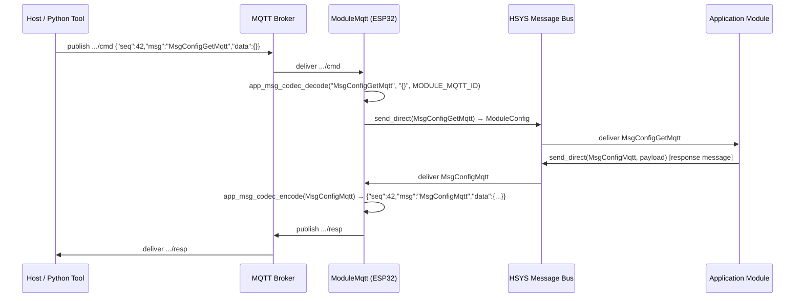
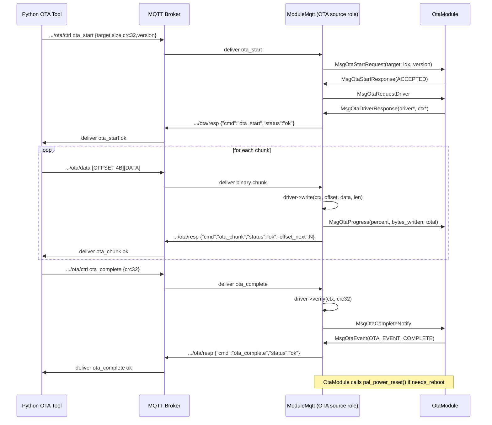

# MQTT Architecture

## 1. Design Goals

- **Single protocol** — JSON over MQTT for all control, config, and telemetry.  Binary only for OTA data chunks.
- **Topic-based routing** — `{dev-type}`, `{group}`, and `{device_id}` in the topic hierarchy replace all in-payload routing fields.
- **Message-queue integration** — the MQTT module is a first-class HSYS module. Incoming commands are decoded into typed HSYS messages and dispatched on the bus. Responses are produced by the application modules, serialized to JSON, and published back.
- **OTA as a built-in source** — the MQTT module implements the OTA source role using the existing `OtaModule` protocol. Binary chunks bypass the message pool entirely.
- **Secure and non-secure** — TLS is toggled by configuration (port 1883 = non-secure, port 8883 = TLS). Development starts with non-secure.

---

## 2. Topic Hierarchy

```
ferp/{dev-type}/{group}/{device_id}/cmd          ← host → device  (command)
ferp/{dev-type}/{group}/{device_id}/resp         ← device → host  (response to command)
ferp/{dev-type}/{group}/{device_id}/evt          ← device → host  (unsolicited event / telemetry)
ferp/{dev-type}/{group}/{device_id}/ota/ctrl     ← host → device  (OTA control, JSON)
ferp/{dev-type}/{group}/{device_id}/ota/data     ← host → device  (OTA binary chunks)
ferp/{dev-type}/{group}/{device_id}/ota/resp     ← device → host  (OTA status responses, JSON)
```

**Wildcard subscriptions the device maintains:**

| Subscription | Meaning |
|---|---|
| `ferp/{dev-type}/{group}/{device_id}/cmd` | Commands to this specific device |
| `ferp/{dev-type}/{group}/+/cmd` | Group-broadcast to all devices of the same type in the group |
| `ferp/+/{group}/+/cmd` | Group-broadcast regardless of device type |

The device subscribes to all three on startup. `{dev-type}`, `{group}`, and `{device_id}` are read from configuration (`MsgConfigMqtt` / device config).

---

## 3. JSON Message Format

All non-OTA-data payloads are UTF-8 JSON.

### 3.1 Unified Envelope

**All three topic kinds (`cmd`, `resp`, `evt`) share the same envelope structure:**

```json
{
  "seq":  42,
  "msg":  "MsgConfigGetMqtt",
  "data": { }
}
```

| Field | Type | Description |
|---|---|---|
| `seq` | uint32 | Sequence number. Host increments per command; device echoes it in the response. Use `0` for unsolicited events. |
| `msg` | string | C++ message class name — e.g. `"MsgConfigGetMqtt"`. This is the key used by `app_msg_codec` to look up the decoder/encoder. String names are used (not numeric IDs) for backward compatibility and readability. |
| `data` | object | Message-specific payload. Mirrors the `Payload` struct of the corresponding C++ message class. May be `{}` for messages with no payload. |

### 3.2 Command example (host → device, `.../cmd`)

Request the device's MQTT broker config:
```json
{ "seq": 42, "msg": "MsgConfigGetMqtt", "data": {} }
```

Set a config field:
```json
{ "seq": 43, "msg": "MsgConfigSet", "data": { "key": "mqtt_host", "type": "string", "value": "broker.local" } }
```

### 3.3 Response example (device → host, `.../resp`)

Device replies with the actual config message — same envelope, different `msg`:
```json
{ "seq": 42, "msg": "MsgConfigMqtt", "data": { "host": "broker.example.com", "port": 1883, "user": "", "password": "" } }
```

### 3.4 Event example (device → host, `.../evt`)

Device publishes a fuel transaction — no prior command, `seq` = 0:
```json
{ "seq": 0, "msg": "MsgFuelPumped", "data": { "nozzle_idx": 0, "vol_lx1000": 5000, "unit_pricex100": 300, "total_pricex100": 1500 } }
```

OTA progress event:
```json
{ "seq": 0, "msg": "MsgOtaProgress", "data": { "target_idx": 0, "percent": 45, "bytes_written": 237568, "total_bytes": 524288 } }
```

### 3.5 `data` field — message payload mapping

The `data` object is a direct JSON representation of the C++ `Payload` struct. The `app_msg_codec` module (see §4.3) owns the decode/encode for each message type.

| `msg` | Direction | `data` fields |
|---|---|---|
| `MsgConfigGetMqtt` | cmd | *(empty)* |
| `MsgConfigGetWifi` | cmd | *(empty)* |
| `MsgConfigGetCloud` | cmd | *(empty)* |
| `MsgConfigGetOta` | cmd | *(empty)* |
| `MsgConfigSet` | cmd | `key` (str), `type` (`"string"`/`"uint32"`/`"bool"`), `value` (str) |
| `MsgConfigMqtt` | resp | `host`, `port`, `user`, `password` |
| `MsgConfigWifi` | resp | `ssid`, `password` |
| `MsgFuelPumped` | evt | `nozzle_idx`, `vol_lx1000`, `unit_pricex100`, `total_pricex100` |
| `MsgNozzleState` | evt | `nozzle_idx`, `state` |
| `MsgSensorData` | evt | `counter`, `temperature` |
| `MsgInternetStatus` | evt | `connected` |
| `MsgOtaEvent` | evt | `event`, `target_idx`, `version` |
| `MsgOtaProgress` | evt | `target_idx`, `percent`, `bytes_written`, `total_bytes` |

---


## 4. Message Flow



### 4.1 Inbound Decode Pipeline (ModuleMqtt internals)

The PAL MQTT callback runs in the broker-client context (ISR-adjacent). It must not block. The raw payload is copied into a small static buffer, an event bit is set, and the ModuleMqtt run-loop does all the real work.

```
 ┌─────────────────────────────────────────────────────────────────┐
 │  PAL MQTT callback  (broker-client context — must not block)    │
 │                                                                 │
 │  1. copy topic + payload into static rx_buf                     │
 │  2. hsys_event_group_set_bits(MQTT_EVENT_MSG_RCVD)              │
 │  3. wake(ModuleMqtt task)                                       │
 └───────────────────────────┬─────────────────────────────────────┘
                             │
                             ▼  (ModuleMqtt run-loop wakes)
 ┌─────────────────────────────────────────────────────────────────┐
 │  Parse envelope JSON  →  extract "seq", "msg", "data"           │
 │                                                                 │
 │  app_msg_codec_decode("MsgConfigGetMqtt", data_json, MODULE_MQTT_ID)
 │       │                                                         │
 │       ▼  (inside app_msg_codec.cpp)                            │
 │  1. look up "msg" string in k_codec_table[]                     │
 │       ┌──────────────────────────────────────────────┐          │
 │       │  app_msg_codec_entry_t {                        │          │
 │       │      msg_name    = "MsgConfigGetMqtt"        │          │
 │       │      msg_id      = MSG_ID_CONFIG_GET_MQTT    │          │
 │       │      dest_module = MODULE_CONFIG_ID          │          │
 │       │      decode      = MsgConfigGetMqtt::mqtt_decode        │
 │       │      encode      = nullptr                   │          │
 │       │  }                                           │          │
 │       └──────────────────────────────────────────────┘          │
 │  2. call decode(data_json, MODULE_MQTT_ID)                      │
 │       → fills MsgConfigGetMqtt::Payload                         │
 │       → calls MsgConfigGetMqtt::create() → hsys_msg_alloc()     │
 │       → returns hsys_msg_t *                                    │
 │  3. store seq → keyed by msg_id (for response matching)         │
 └───────────────────────────┬─────────────────────────────────────┘
                             │
                             ▼
 ┌─────────────────────────────────────────────────────────────────┐
 │  HSYS Message Bus                                               │
 │                                                                 │
 │  dest_module != 0  →  send_direct(msg, dest_module)             │
 │  dest_module == 0  →  publish(msg)  [NOTIFICATION broadcast]    │
 └───────────────────────────┬─────────────────────────────────────┘
                             │
                             ▼
 ┌─────────────────────────────────────────────────────────────────┐
 │  Destination Module  (e.g. ModuleConfig)                        │
 │                                                                 │
 │  on_msg_received(msg):                                          │
 │    case MsgConfigGetMqtt::ID:                                   │
 │      p = MsgConfigGetMqtt::deserialize(msg)                     │
 │      // process ...                                             │
 │      send_direct<MsgConfigMqtt>(MODULE_ID_MQTT, response_payload│
 └─────────────────────────────────────────────────────────────────┘
```

**Memory ownership:** `hsys_msg_alloc()` takes a slot from the pre-allocated message pool. The bus decrements the ref-count when every subscriber has consumed the message. ModuleMqtt never holds a raw pointer after posting.

---

### 4.2 Outbound Encode Pipeline

```
 ┌─────────────────────────────────────────────────────────────────┐
 │  ModuleMqtt::on_msg_received(msg)                               │
 │  (response message arrives from application module)             │
 │                                                                 │
 │  1. app_msg_codec_encode(msg) → msg_name + data_json               │
 │  2. retrieve stored seq keyed by msg->id                        │
 │  3. build envelope:                                             │
 │       { "seq": <stored_seq>,                                    │
 │         "msg": "<MsgClassName>",                                │
 │         "data": <encoded_data> }                                │
 │  4. serialize to char buffer                                    │
 │  5. pal_mqtt_publish(.../resp, buffer, len, qos=1)              │
 └─────────────────────────────────────────────────────────────────┘
```

The `seq` value is stored by ModuleMqtt when it receives the inbound command and retrieved when the matching response message arrives. It is keyed by `msg_id` (the numeric ID of the expected response message type).

---

### 4.3 Codec Module (`app_msg_codec`)

The codec is split across two layers:

| Layer | File | Contents |
|---|---|---|
| Message library | `src/app-messages/app_msg_codec.h` | Registry API — `app_msg_codec_register`, `decode`, `encode`, `get_dest` |
| Message library | `src/app-messages/app_msg_codec.cpp` | Registry implementation (no message-type knowledge) |
| Application | `src/product/app/app.cpp` | `k_codec_table[]` — which messages are exposed over JSON transport |

**Startup sequence:**

```cpp
// In app_init() (app.cpp), before transport modules are initialised:
app_msg_codec_register(k_codec_table,
                       sizeof(k_codec_table) / sizeof(k_codec_table[0]));
```

**Adding a new message to the JSON interface:**

1. Add `mqtt_decode` and/or `mqtt_encode` to the message class in its own `.cpp`/`.h`
2. `#include` its header at the top of `app.cpp`
3. Add a row to `k_codec_table[]` in `app.cpp`

No changes to the codec infrastructure files are needed.

---

## 5. OTA Flow

The MQTT module acts as an **OTA source** in the OtaModule protocol. Binary chunk data bypasses the HSYS message pool entirely — it is written directly via the driver function pointers.

### 5.1 OTA Control Messages (JSON on `.../ota/ctrl`)

**ota_start:**
```json
{ "seq": 1, "cmd": "ota_start", "data": { "target": "main", "size": 524288, "version": "1.2.3", "crc32": "0xDEADBEEF" } }
```
Targets: `"main"` (esp32 main), `"sub1"` (esp07-disptap)

**ota_status:**
```json
{ "seq": 2, "cmd": "ota_status" }
```

**ota_abort:**
```json
{ "seq": 3, "cmd": "ota_abort" }
```

### 5.2 OTA Binary Chunks (`.../ota/data`)

Raw binary, little-endian header:

```
[ OFFSET  — 4 bytes, big-endian ][ CHUNK_DATA — N bytes ]
```

- No frame envelope, no per-chunk CRC.
- Maximum chunk size limited by broker payload limit (typically 64 KB; recommended: 4 KB).
- Chunks may arrive out of order; the OTA handler rejects unexpected offsets and responds with the next expected offset.

### 5.3 OTA Responses (JSON on `.../ota/resp`)

```json
{ "seq": 1, "cmd": "ota_start",    "status": "ok" }
{ "seq": 1, "cmd": "ota_start",    "status": "error", "code": "busy" }
{ "cmd":    "ota_chunk",           "status": "ok",    "offset_next": 4096 }
{ "cmd":    "ota_chunk",           "status": "error", "offset_expecting": 4096 }
{ "seq": 3, "cmd": "ota_complete", "status": "ok" }
{ "seq": 3, "cmd": "ota_complete", "status": "error", "code": "crc_mismatch" }
```

### 5.4 OTA Sequence Diagram



### 5.5 OTA State Machine (inside ModuleMqtt)

```
MQTT_OTA_IDLE
  │  ota_start received
  ▼
MQTT_OTA_REQUESTING
  │  MsgOtaStartResponse(ACCEPTED) + MsgOtaDriverResponse received
  ▼
MQTT_OTA_ACTIVE
  │  all chunks received + ota_complete received
  ▼
MQTT_OTA_VERIFYING
  │  CRC matches
  ▼
MQTT_OTA_IDLE  (session done, OtaModule reboots if needed)

Any state + ota_abort / timeout / REJECTED → MQTT_OTA_IDLE
```

---

## 6. Secure vs Non-Secure

| Mode | Port | Config |
|---|---|---|
| Non-secure (default) | 1883 | `MsgConfigMqtt.tls_enabled = false` |
| TLS | 8883 | `MsgConfigMqtt.tls_enabled = true` + CA cert in config |

The PAL MQTT layer switches transport based on port/config. No code changes needed in ModuleMqtt — only the `pal_mqtt_config_t` changes.

---

## 7. Folder Structure

```
src/
└── app-modules/
    └── module_mqtt/
        ├── ModuleMqtt.h            — HSYS module class; manages lifecycle, subscriptions, publish
        ├── ModuleMqtt.cpp
        ├── mqtt_topic.h            — topic builder / parser ({dev-type}/{group}/{device_id})
        ├── mqtt_topic.cpp
        ├── mqtt_json_codec.h       — encode / decode registry (msg_id string ↔ HSYS message)
        ├── mqtt_json_codec.cpp
        ├── mqtt_ota_handler.h      — OTA state machine (OTA source role)
        └── mqtt_ota_handler.cpp

src/
└── app-messages/
    └── msg_mqtt_status.h/.cpp      — MsgMqttStatus notification (connected / disconnected)

tools/
└── ferp-mqtt-tool/
    ├── ferp_mqtt_tool.py           — CLI: send commands, read events
    ├── ferp_mqtt_ota.py            — OTA tool: stream firmware over MQTT
    ├── messages/
    │   └── msg_defs.py             — msg_id strings + payload schemas
    └── requirements.txt
```

---

## 8. Module Interface Summary

### ModuleMqtt messages handled

| Message | Direction | Action |
|---|---|---|
| `MsgConfigMqtt` | inbound | Store broker config; connect |
| `MsgWifiEvent(GOT_IP)` | inbound | Trigger connect |
| `MsgInternetStatus(CONNECTED)` | inbound | Allow reconnect |
| `MsgOtaStartResponse` | inbound | Forward to OTA handler |
| `MsgOtaDriverResponse` | inbound | Forward to OTA handler |
| `MsgOtaEvent` | inbound | Forward to OTA handler; publish ota/resp |
| any registered response msg | inbound | JSON encode + publish on .../resp |

### ModuleMqtt messages sent

| Message | Trigger |
|---|---|
| `MsgMqttStatus` | Connection state change |
| `MsgOtaStartRequest` | ota_start ctrl command received |
| `MsgOtaRequestDriver` | After ACCEPTED |
| `MsgOtaProgress` | After each successful chunk write |
| `MsgOtaCompleteNotify` | After successful CRC verify |
| `MsgOtaAbortRequest` | On ota_abort ctrl command |
| *(decoded command messages)* | On every valid inbound .../cmd |

---

## 9. Python Tool Usage

### Send a command

```bash
python ferp_mqtt_tool.py \
  --broker 192.168.1.100 \
  --port 1883 \
  --dev-type ferp-fuel \
  --group site_a \
  --device-id AA:BB:CC:DD:EE:FF \
  --cmd MSG_CONFIG_GET_MQTT
```

### Send a command with data

```bash
python ferp_mqtt_tool.py \
  --broker 192.168.1.100 --port 1883 \
  --dev-type ferp-fuel --group site_a --device-id AA:BB:CC:DD:EE:FF \
  --cmd MSG_CONFIG_SET \
  --data '{"key":"mqtt_host","value":"broker.local"}'
```

### OTA update

```bash
python ferp_mqtt_ota.py \
  --broker 192.168.1.100 --port 1883 \
  --dev-type ferp-fuel --group site_a --device-id AA:BB:CC:DD:EE:FF \
  --target main \
  --firmware firmware_v1.2.3.bin \
  --chunk-size 4096
```
