# ferp-com-main — Product Specification

> **Scope:** Product-specific documentation for the `ferp-com-main` firmware.  
> Framework fundamentals (HSYS, message bus, OTA protocol) are in the [HSYS FW User Manual](../../documents/HSYS%20FW%20User%20Manual.md).

---

## Table of Contents

1. [Product Overview](#1-product-overview)
2. [Build Targets](#2-build-targets)
3. [Module Configuration](#3-module-configuration)
4. [Task Layout](#4-task-layout)
5. [Boot Sequence](#5-boot-sequence)
6. [Message Flows](#6-message-flows)
7. [OTA Configuration](#7-ota-configuration)
8. [MQTT Bridge](#8-mqtt-bridge)
9. [Configuration File](#9-configuration-file)

---

## 1. Product Overview

`ferp-com` is a fuel-dispenser communication controller that:

- Connects to a WiFi network and cloud backend
- Reads fuel-dispensed transactions from DispTap hardware
- Relays events and accepts commands over MQTT
- Supports OTA firmware update over MQTT and HTTP cloud polling
- Synchronises real-time clock from DS1307 RTC and NTP
- Logs to SD card

---

### 1.1 Hardware Block Diagram

```
┌────────────────────────────────────────────────────────────┐
│                     ferp-com (ESP32)                       │
│                                                            │
│  ┌─────────────┐  TCP/IP    ┌────────────────────────────┐ │
│  │  DispTap    │◄──────────►│  ModuleFuel + sanki6       │ │
│  │  (fuel HW)  │            │  (nozzle state machine)    │ │
│  └─────────────┘            └────────────────────────────┘ │
│                                                            │
│  ┌─────────────┐            ┌────────────────────────────┐ │
│  │  DS1307 RTC │◄──I2C─────►│  ModuleTimeMgr             │ │
│  └─────────────┘            └────────────────────────────┘ │
│                                                            │
│  ┌─────────────┐            ┌────────────────────────────┐ │
│  │  SD card    │◄──SPI─────►│  ModuleSD                  │ │
│  └─────────────┘            └────────────────────────────┘ │
│                                                            │
│  ┌─────────────┐  GPIO      ┌────────────────────────────┐ │
│  │  Buttons    │───────────►│  ModuleDefaultBtn          │ │
│  │  (default,  │            │  ModulePrintBtn            │ │
│  │   printer)  │            └────────────────────────────┘ │
│  └─────────────┘                                           │
│                                                            │
│  ┌─────────────┐  GPIO      ┌────────────────────────────┐ │
│  │  LED strip  │◄───────────│  ModuleLeds                │ │
│  └─────────────┘            └────────────────────────────┘ │
│                                                            │
│  ┌─────────────┐  GPIO      ┌────────────────────────────┐ │
│  │  Piezo buz  │◄───────────│  ModuleBuzzer              │ │
│  └─────────────┘            └────────────────────────────┘ │
│                                                            │
│  ┌─────────────┐  WiFi      ┌────────────────────────────┐ │
│  │  Broker     │◄──────────►│  ModuleMqtt (MQTT bridge   │ │
│  │  (EMQX etc) │            │  + OTA source)             │ │
│  └─────────────┘            └────────────────────────────┘ │
│                                                            │
│  ┌─────────────┐  HTTPS     ┌────────────────────────────┐ │
│  │  OTA server │◄──────────►│  ModuleWebClientOta        │ │
│  └─────────────┘            └────────────────────────────┘ │
│                                                            │
│  ┌─────────────┐  HTTPS     ┌────────────────────────────┐ │
│  │  Cloud      │◄──────────►│  ModuleCloud               │ │
│  │  (CubeSphere│            │  (cube_sphere driver)      │ │
│  └─────────────┘            └────────────────────────────┘ │
└────────────────────────────────────────────────────────────┘
```

---

## 2. Build Targets

| Target | Entry point | Notes |
|--------|------------|-------|
| **ESP32-IDF** | `ferp-com-esp32-idf/main/main.cpp` | Production firmware (`app_main → app_init`) |
| **macOS Simulator** | `ferp-com-simulator/main/` | Native binary via `sim_app_init()`, writes OTA to `ota_download.bin` |

### 2.1 Simulator Extras

The simulator registers one additional module injected via `app_register_extra_module()`:

| Module | ID | Purpose |
|--------|-----|---------|
| `ModuleSimBridge` | 20 | TCP socket on port 9000 — UI command bridge |
| `ModuleWebServer` | 21 | HTTP config server on port 8080 (OTA upload) |
| `ModuleMqtt` | 22 | MQTT client — same binary as ESP32 |

---

## 3. Module Configuration

### 3.1 Active Modules

| ID | Module | Task | Stack | Priority |
|----|--------|------|-------|----------|
| 3 | `Ticker` | `timing_task` | 2 048 | 4 |
| 4 | `ModuleSysmon` | `indicator_task` | 2 048 | 4 |
| 5 | `ModuleSpiffs` | `storage_task` | 4 096 | 5 |
| 6 | `ModuleConfig` | `storage_task` | 4 096 | 5 |
| 7 | `ModuleTimer` | `timing_task` | 2 048 | 4 |
| 8 | `ModuleLeds` | `indicator_task` | 2 048 | 4 |
| 9 | `ModuleDefaultBtn` | `btn_task` | 2 048 | 5 |
| 10 | `ModulePrintBtn` | `btn_task` | 2 048 | 5 |
| 11 | `ModuleFuel` | `fuel_task` | 4 096 | 5 |
| 12 | `ModuleBuzzer` | `indicator_task` | 2 048 | 4 |
| 13 | `ModuleCloud` | `network_task` | 8 192 | 5 |
| 14 | `ModuleInternet` | `network_task` | 8 192 | 5 |
| 15 | `ModuleWifi` | `network_task` | 8 192 | 5 |
| 16 | `ModuleSD` | `storage_task` | 4 096 | 5 |
| 17 | `ModuleTimeMgr` | `timemgr_task` | 3 072 | 5 |
| 18 | `OtaModule` | `ota_task` | 4 096 | 5 |
| 19 | `ModuleWebClientOta` | `web_ota_task` | 8 192 | 4 |
| 22 | `ModuleMqtt` | `mqtt_task` (extra) | 8 192 | 5 |
| 23 | `ModuleMsgTranslator` | `xlat_task` | 3 072 | 5 |

---

### 3.2 Ticker

**Purpose:** 1 s heartbeat.

```
soft_timer(1000ms) ──► publish MsgTick1000ms
```

No configuration. All modules that need periodic processing subscribe to `MsgTick1000ms`.

---

### 3.3 ModuleSysmon

**Purpose:** Print pool + message-header stats every 5 s.

| Param | Default | Override |
|-------|---------|---------|
| Report interval | 5 ticks (5 s) | `SYSMON_REPORT_INTERVAL_TICKS` |

---

### 3.4 ModuleSpiffs / ModuleSD

```
pre_init()  → pal_spiffs_mount() / pal_sd_mount()
post_init() → publish MsgSpiffsReady / MsgSdReady
```

No runtime messages handled. Downstream modules wait for these one-shot notifications.

---

### 3.5 ModuleConfig

**Config file:** `Configs/DeviceConfigs.json` on SPIFFS.

**Supported keys** (loaded on `MsgSpiffsReady`):

| Key | Type | Default | Description |
|-----|------|---------|-------------|
| `ssid` | string | `"MyNetwork"` | WiFi SSID |
| `password` | string | `"password123"` | WiFi password |
| `cloud_url` | string | `"https://cloud.example.com"` | Cloud endpoint |
| `cloud_secret` | string | `"changeme"` | Cloud auth secret |
| `ota_srvr_url` | string | `"http://144.24.156.245:8080"` | OTA server URL |
| `ota_chk_int` | uint32 | `30` | OTA check interval (s) |
| `display_type` | uint32 | `0` | DispTap display variant |
| `cptr_delay` | uint32 | `500` | Capture stabilise delay (ms) |
| `printer_url` | string | `"http://printer.local"` | Printer endpoint |
| `p_cpy_cnt` | uint32 | `1` | Printer copy count |
| `hb_interval` | uint32 | `60` | Cloud heartbeat interval (s) |
| `mqtt_host` | string | `"broker.emqx.io"` | MQTT broker host |
| `mqtt_port` | uint32 | `1883` | MQTT broker port |
| `mqtt_user` | string | `""` | MQTT username |
| `mqtt_pass` | string | `""` | MQTT password |
| `device_uuid` | string | `"00000000-…"` | Device UUID (MQTT topic) |
| `device_group` | string | `"default"` | Device group (MQTT topic) |
| `en_udp_ser` | bool | `false` | Enable UDP log server |
| `udp_srvr_ip` | string | `"192.168.1.100"` | UDP log server IP |
| `udp_srvr_port` | uint32 | `4444` | UDP log server port |

**Sequence:**

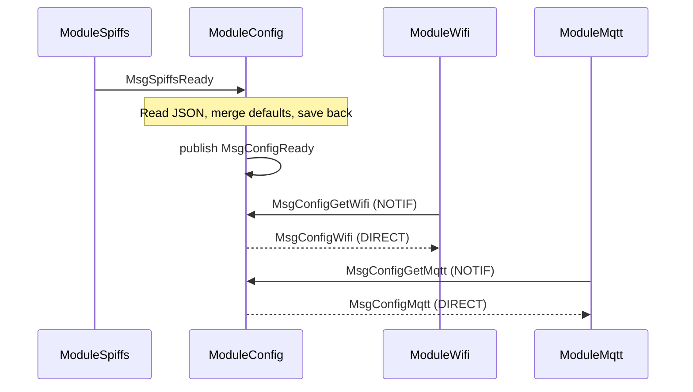

---

### 3.6 ModuleTimer

| Param | Value |
|-------|-------|
| Max slots | 20 |
| Resolution | ±100 ms |
| Slot policy | One slot per `source_module_id` |

---

### 3.7 ModuleWifi

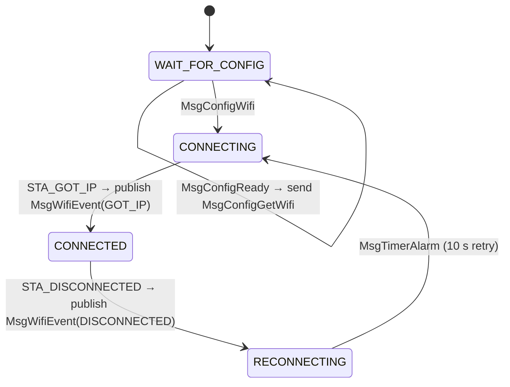

---

### 3.8 ModuleInternet

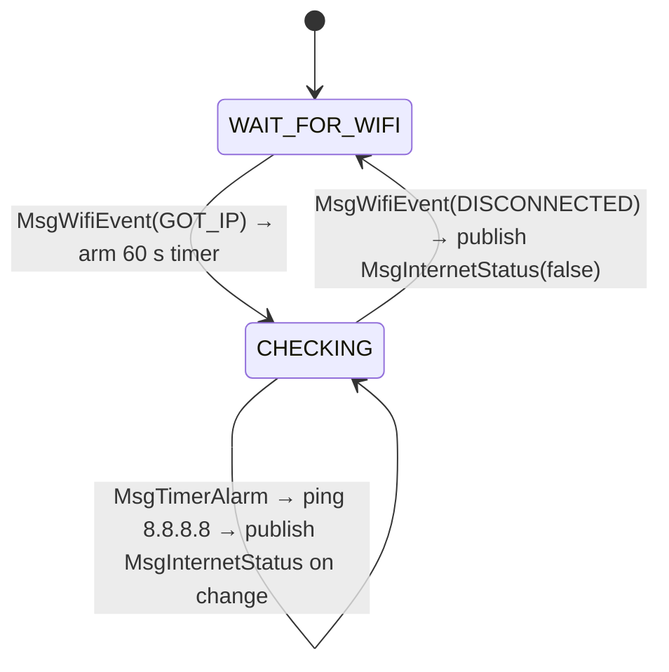

---

### 3.9 ModuleCloud (CubeSphere backend)

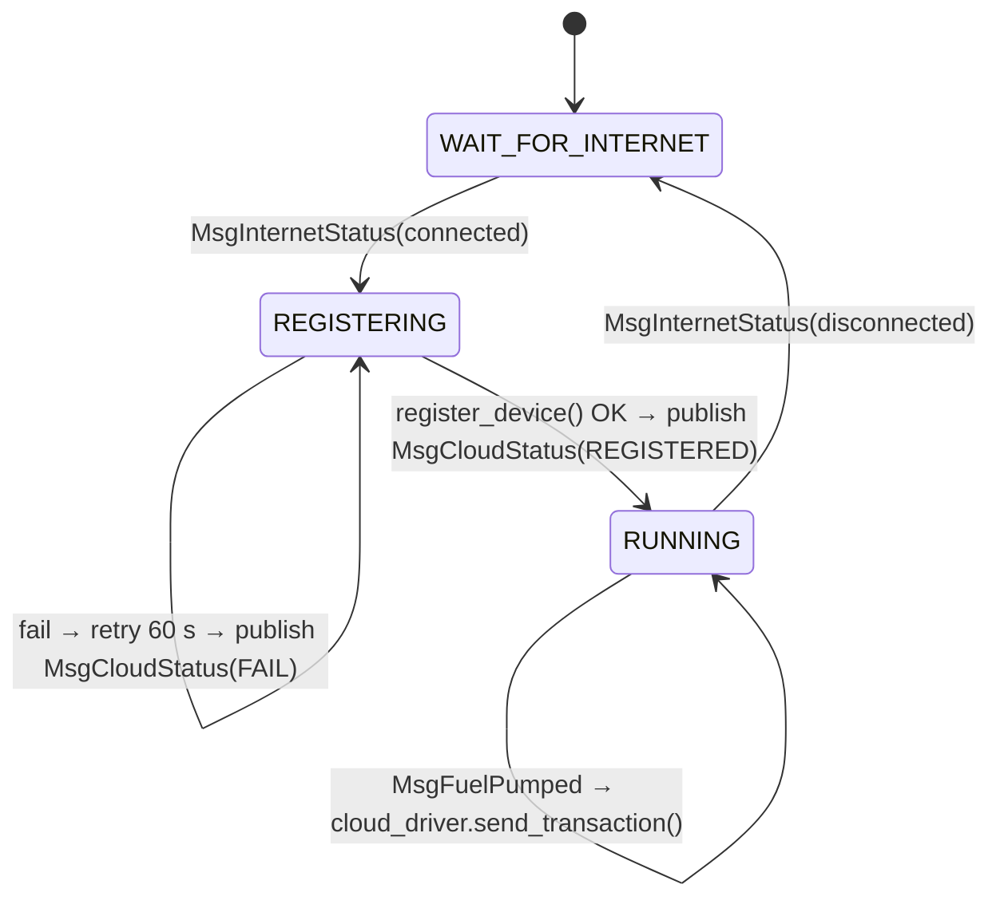

**Cloud driver wiring:**

```c
ModuleCloud::instance()->set_driver(cloud_driver_cube_sphere());
```

---

### 3.10 ModuleFuel (DispTap)

**Purpose:** Receives binary frames from DispTap hardware over TCP, runs the sanki6 state machine per nozzle, and publishes transaction events.

```
TCP frame callback (foreign thread)
  └─ _on_distap_frame() → hsys_queue_send(_frame_queue) → wake()
        │
        └─ on_wake() (module task thread)
               └─ _process_queues()
                      └─ sanki6_process_data()
                         sanki6_validate()
                         sanki6_state_machine()
                              │
                    ┌─────────┴──────────┐
                    ▼                    ▼
           publish MsgNozzleState  publish MsgFuelPumped
```

| Config | Source |
|--------|--------|
| `display_type` | `MsgConfigDt.display_type` |
| `stabilize_delay_ms` | `MsgConfigDt.stabilize_delay_ms` |

---

### 3.11 ModuleTimeMgr

**Time source priority (low → high):**

```
NONE → SPIFFS backup → DS1307 RTC (I2C) → NTP
```

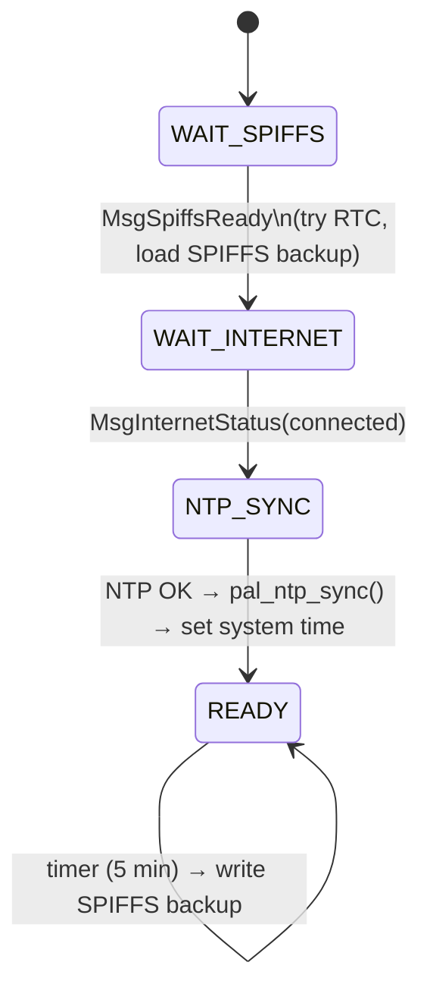

| Param | Value |
|-------|-------|
| Backup interval | 5 min |
| NTP trigger | On every `MsgInternetStatus(connected)` |
| SPIFFS path | `rtc_backup.bin` |

---

### 3.12 ModuleLeds / ModuleBuzzer

**LED patterns:**

| Event | LED reaction |
|-------|-------------|
| `MsgConfigReady` | Boot indication |
| `MsgWifiEvent(GOT_IP)` | WiFi connected |
| `MsgInternetStatus(connected)` | Internet online |
| `MsgOtaEvent(SESSION_STARTED)` | OTA in progress |
| `MsgOtaEvent(COMPLETE)` | OTA done |
| `MsgOtaEvent(SESSION_ABORTED)` | OTA failed |

**Buzzer patterns:**

| Event | Pattern |
|-------|---------|
| `MsgConfigReady` | Boot chime |
| `MsgPrinterBtn` (print-1 short) | 2 s solid tone |
| `MsgFuelPumped` | Double blip |

---

### 3.13 ModuleMqtt

**Purpose:** Bridges the HSYS message bus to an MQTT broker. Also acts as an OTA source.

**State machine:**

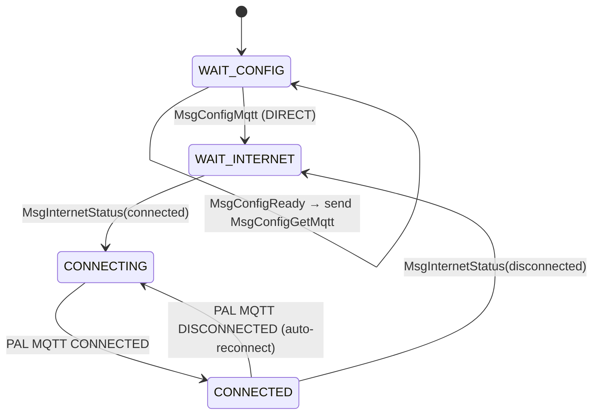

**Topic structure:**

```
ferp/ferp-com/{group}/{device_id}/cmd    ← subscribe (inbound commands)
ferp/ferp-com/{group}/{device_id}/resp   ← publish (direct responses)
ferp/ferp-com/{group}/{device_id}/evt    ← publish (unsolicited events)
ferp/ferp-com/{group}/{device_id}/ota/ctrl  ← subscribe (OTA control)
ferp/ferp-com/{group}/{device_id}/ota/data  ← subscribe (OTA binary)
ferp/ferp-com/{group}/{device_id}/ota/resp  ← publish (OTA status)
```

**Messages forwarded to broker (evt topic):**

| Message | Direction |
|---------|-----------|
| `MsgFuelPumped` | → evt |
| `MsgNozzleState` | → evt |
| `MsgOtaEvent` | → evt |
| `MsgOtaProgress` | → evt |
| `MsgInternetStatus` | → evt |

**Messages forwarded from broker (cmd → bus):**

| JSON `msg` field | → HSYS message |
|------------------|----------------|
| `MsgConfigGetMqtt` | → ModuleConfig |
| `MsgConfigGetWifi` | → ModuleConfig |
| `MsgConfigGetCloud` | → ModuleConfig |
| `MsgConfigGetOta` | → ModuleConfig |
| `MsgConfigSet` | → broadcast |

**OTA source state machine (within ModuleMqtt):**

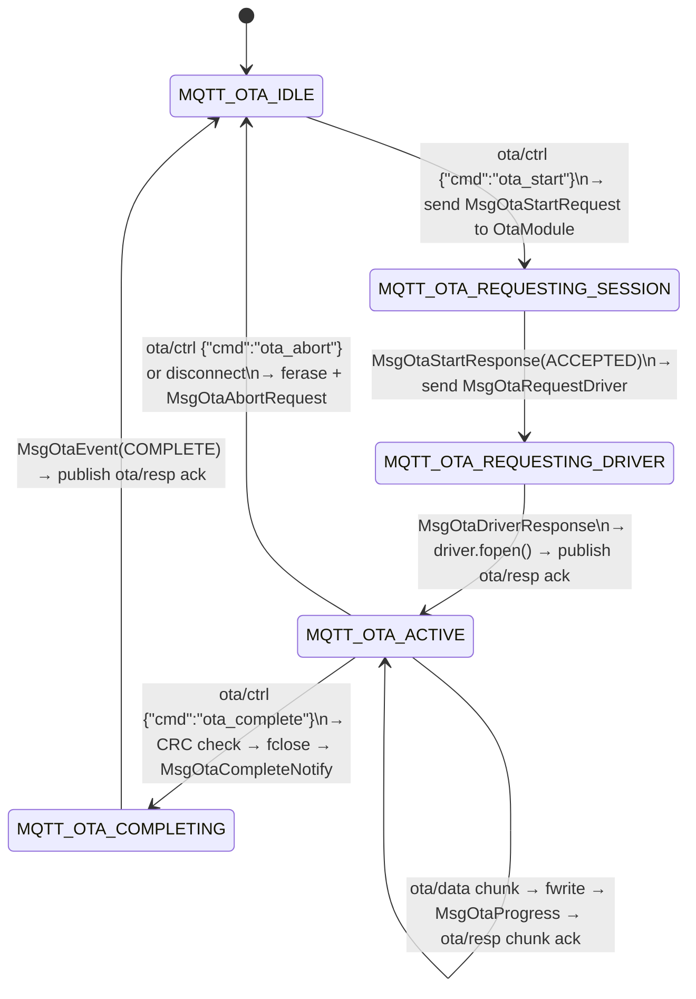

---

### 3.14 ModuleWebClientOta

**Purpose:** Periodically polls the OTA server for each configured target and downloads updates as an OTA source.

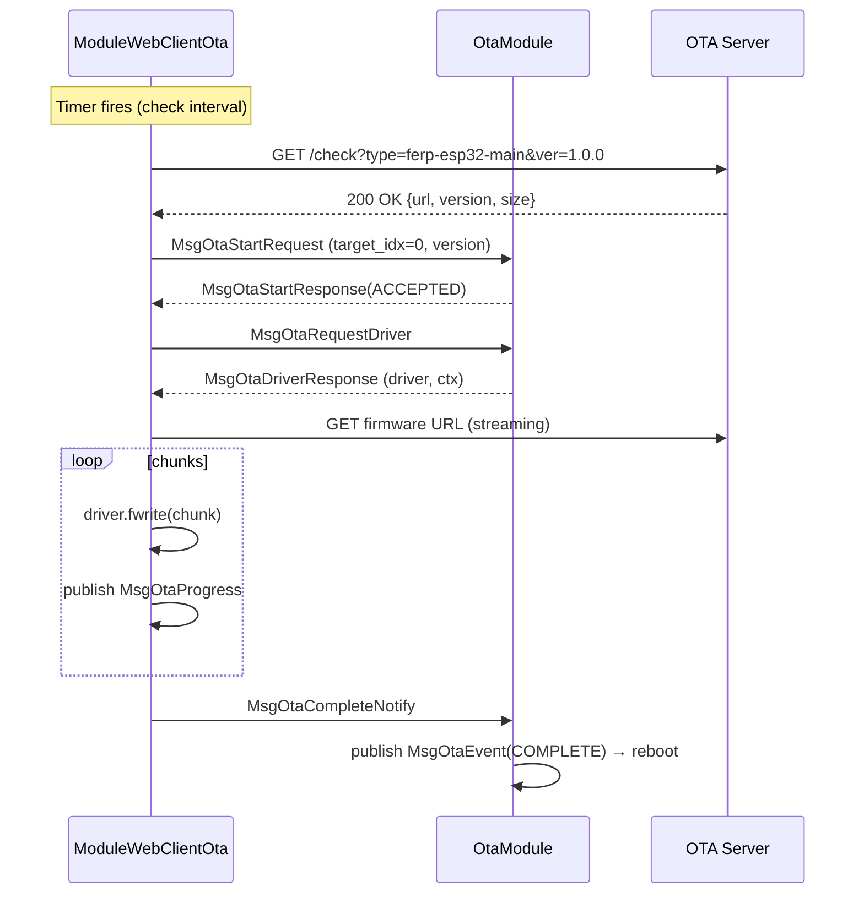

| Config | Source | Default |
|--------|--------|---------|
| `server_url` | `MsgConfigOta.server_url` | `http://144.24.156.245:8080` |
| `check_interval_s` | `MsgConfigOta.check_interval_s` | 30 s |
| Min interval | compile-time | 30 s |
| Max interval | compile-time | 300 s |

**Targets polled:**

| `target_idx` | `firmware_type` | Notes |
|---|---|---|
| 0 | `ferp-esp32-main` | Main ESP32 firmware |

---

### 3.15 ModuleMsgTranslator

**Purpose:** Decouples modules via a rule table. Currently empty in the base product — extend by adding rows to `k_translator_table[]` in `app.cpp` and implementing functions in `msg_translators.cpp`.

---

## 4. Task Layout

```
┌──────────────────┬─────────────────────────────────────┬───────┬──────┐
│ Task             │ Modules                             │ Stack │ Pri  │
├──────────────────┼─────────────────────────────────────┼───────┼──────┤
│ storage_task     │ ModuleSpiffs, ModuleSD, ModuleConfig │ 4 096 │  5   │
│ timing_task      │ Ticker, ModuleTimer                  │ 2 048 │  4   │
│ indicator_task   │ ModuleSysmon, ModuleLeds, ModuleBuz  │ 2 048 │  4   │
│ btn_task         │ ModulePrintBtn, ModuleDefaultBtn     │ 2 048 │  5   │
│ fuel_task        │ ModuleFuel                           │ 4 096 │  5   │
│ network_task     │ ModuleWifi, ModuleInternet, ModuleCloud│ 8 192│  5   │
│ timemgr_task     │ ModuleTimeMgr                        │ 3 072 │  5   │
│ ota_task         │ OtaModule                            │ 4 096 │  5   │
│ web_ota_task     │ ModuleWebClientOta                   │ 8 192 │  4   │
│ xlat_task        │ ModuleMsgTranslator                  │ 3 072 │  5   │
│ mqtt_task (extra)│ ModuleMqtt                           │ 8 192 │  5   │
└──────────────────┴─────────────────────────────────────┴───────┴──────┘
```

---

## 5. Boot Sequence

```mermaid
sequenceDiagram
    participant M as main()
    participant A as app_init()
    participant SP as ModuleSpiffs
    participant CF as ModuleConfig
    participant WF as ModuleWifi
    participant IN as ModuleInternet
    participant CL as ModuleCloud
    participant MQ as ModuleMqtt
    participant TM as ModuleTimeMgr

    M->>A: app_init()
    A->>A: hsys_pool_init()
    A->>A: hsys_module_init()
    A->>A: hsys_msg_init()
    A->>A: hsys_task_mgr_init() — all tasks start

    Note over SP: pre_init → pal_spiffs_mount()
    Note over SP: post_init
    SP->>CF: MsgSpiffsReady
    Note over CF: Read JSON config, merge defaults
    CF->>CF: MsgConfigReady (broadcast)

    WF->>CF: MsgConfigGetWifi
    CF-->>WF: MsgConfigWifi
    WF->>WF: pal_wifi_sta_connect()

    MQ->>CF: MsgConfigGetMqtt
    CF-->>MQ: MsgConfigMqtt (cached; wait for internet)

    TM->>TM: try DS1307 RTC
    TM->>TM: load SPIFFS time backup

    WF->>WF: STA_GOT_IP
    WF->>IN: MsgWifiEvent(GOT_IP)
    IN->>IN: start ping timer
    IN->>CL: MsgInternetStatus(connected)
    IN->>MQ: MsgInternetStatus(connected)
    IN->>TM: MsgInternetStatus(connected)

    CL->>CL: register_device()
    MQ->>MQ: pal_mqtt_connect()
    TM->>TM: pal_ntp_sync()
```

---

## 6. Message Flows

### 6.1 Fueling Transaction

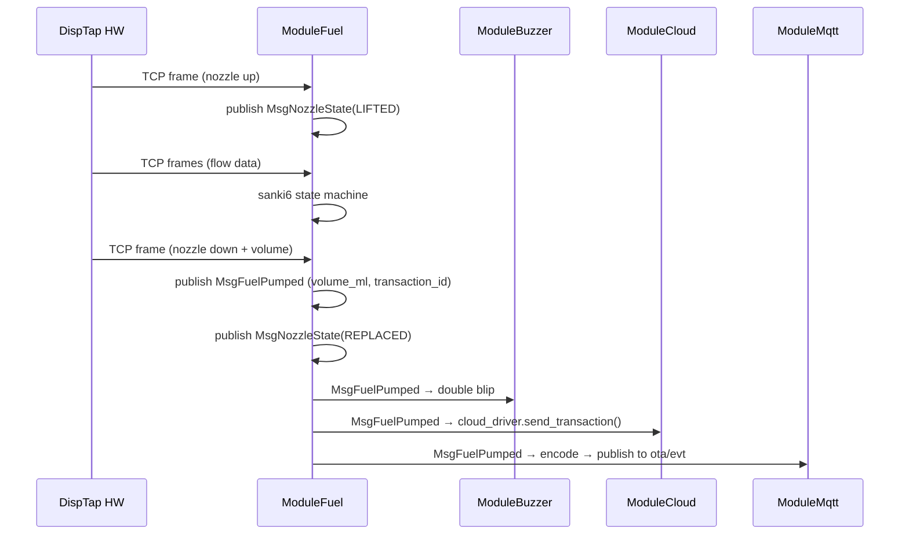

---

### 6.2 MQTT Command (Config Request)

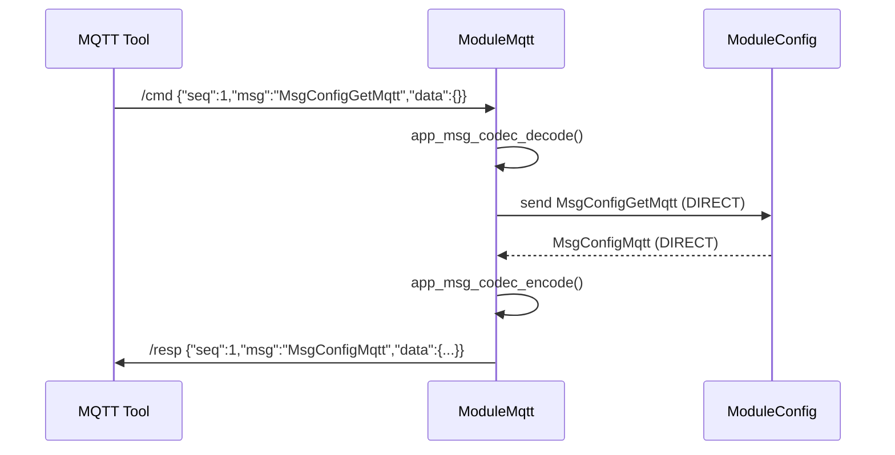

---

### 6.3 OTA via MQTT

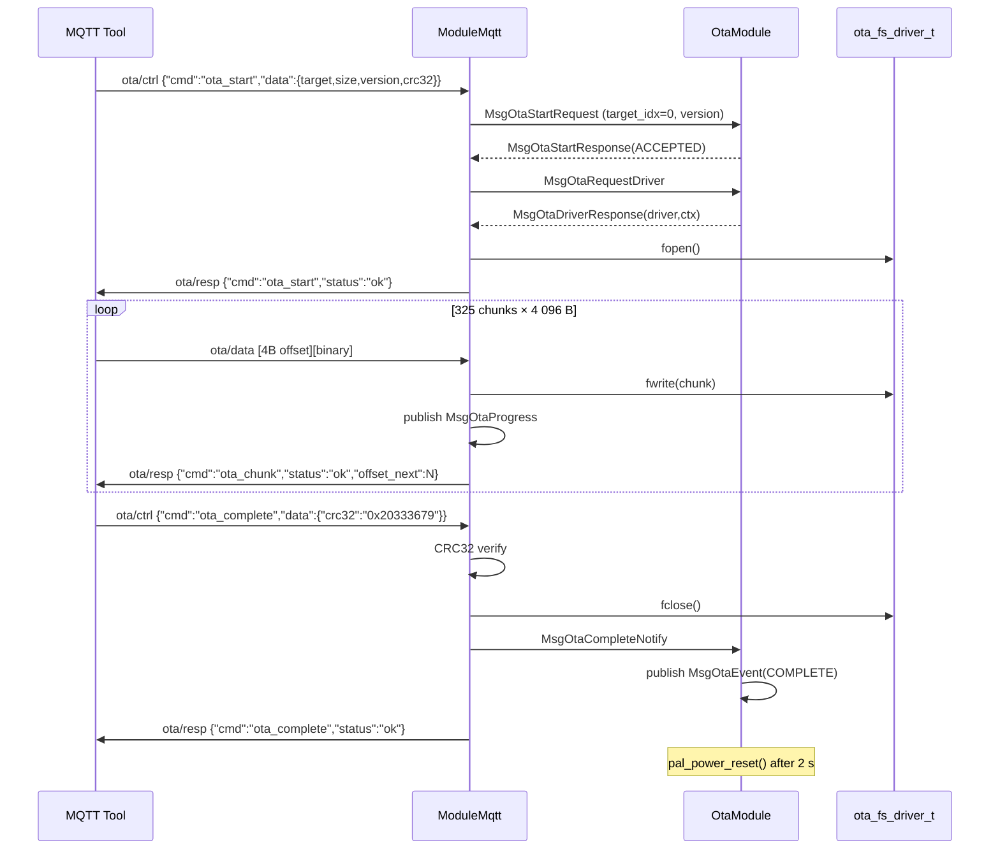

---

### 6.4 OTA via Web Client (Cloud Poll)

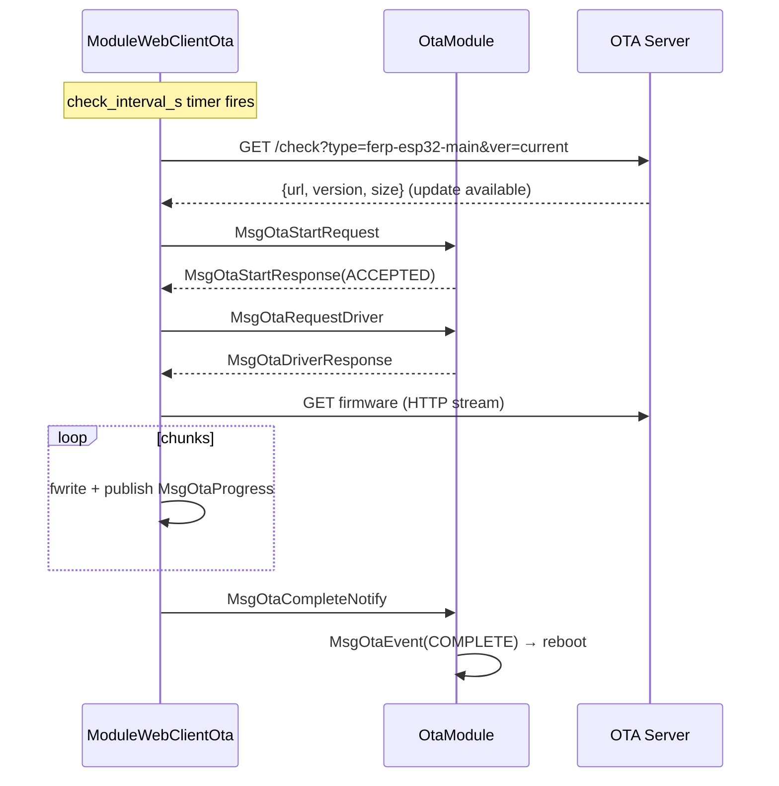

---

## 7. OTA Configuration

### 7.1 Authorised OTA Sources

| Module | `source_module_id` | Timeout |
|--------|--------------------|---------|
| ModuleMqtt | 22 | 60 s |
| ModuleWebServer (sim) | 21 | 120 s |
| ModuleWebClientOta | 19 | 120 s |

### 7.2 Firmware Targets

| `target_idx` | Label | `needs_reboot` | Driver | Destination |
|---|---|---|---|---|
| 0 | `esp32-main` | ✅ | `ota_driver_esp32_main` | ESP-IDF OTA partition / `ota_download.bin` (sim) |
| 1 | `esp32-dt-boot` | ❌ | `ota_driver_esp32_dt` | `SPIFFS: esp32/bootloader.bin` |
| 2 | `esp32-dt-part` | ❌ | `ota_driver_esp32_dt` | `SPIFFS: esp32/partitions.bin` |
| 3 | `esp32-dt-fw` | ❌ | `ota_driver_esp32_dt` | `SPIFFS: esp32/firmware.bin` |

---

## 8. MQTT Bridge

### 8.1 MQTT Topic Variables

| Variable | Source |
|----------|--------|
| `{group}` | `device_group` from config |
| `{device_id}` | `device_uuid` from config (hyphens stripped, lower-cased) |

**Default:** `ferp/ferp-com/default/00000000000000000000000000000000/…`

### 8.2 JSON Codec Table

| JSON `msg` | ID | Direction | Payload |
|---|---|---|---|
| `MsgConfigGetMqtt` | `0x0305` | cmd | — |
| `MsgConfigGetWifi` | `0x0303` | cmd | — |
| `MsgConfigGetCloud` | `0x0304` | cmd | — |
| `MsgConfigGetOta` | `0x030B` | cmd | — |
| `MsgConfigSet` | `0x0301` | cmd | `key`, `value` |
| `MsgConfigMqtt` | `0x0309` | resp | `host`, `port`, `user`, `password` |
| `MsgConfigWifi` | `0x0307` | resp | `ssid`, `password` |
| `MsgConfigCloud` | `0x0308` | resp | `url`, `secret`, `hb_interval_s`, `hb_enabled` |
| `MsgConfigOta` | `0x030C` | resp | `server_url`, `check_interval_s` |
| `MsgFuelPumped` | `0x0800` | evt | `volume_ml`, `transaction_id` |
| `MsgNozzleState` | `0x0801` | evt | `state`, `nozzle_id` |
| `MsgInternetStatus` | `0x0A01` | evt | `connected` |
| `MsgOtaEvent` | `0x0A09` | evt | `event`, `target_idx`, `version` |
| `MsgOtaProgress` | `0x0A0A` | evt | `target_idx`, `percent`, `bytes_written`, `total_bytes` |

---

## 9. Configuration File

**Path on device:** `Configs/DeviceConfigs.json` (SPIFFS)  
**Path in simulator:** `ferp-com-simulator/SPIFFS/Configs/DeviceConfigs.json`

```json
{
  "ssid":          "MyNetwork",
  "password":      "password123",
  "mqtt_host":     "broker.emqx.io",
  "mqtt_port":     1883,
  "mqtt_user":     "",
  "mqtt_pass":     "",
  "device_uuid":   "00000000-0000-0000-0000-000000000000",
  "device_group":  "default",
  "cloud_url":     "https://cloud.example.com",
  "cloud_secret":  "changeme",
  "ota_srvr_url":  "http://144.24.156.245:8080",
  "ota_chk_int":   30,
  "display_type":  0,
  "cptr_delay":    500
}
```

Keys not present in the file are filled from compile-time defaults in `app_config_load_defaults()`.  
Unknown keys are silently ignored. The file is rewritten after every load to normalise it.
